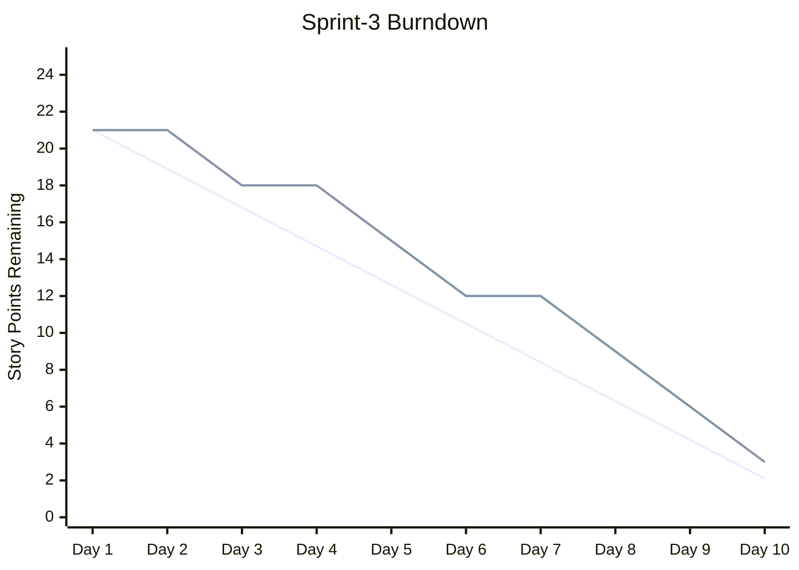

# /project:burndown

## Mission

Generate a sprint burndown chart in Mermaid format showing daily progress against the ideal burndown line. Track story points, stories, or tasks completed over time.

## Prerequisites

- `.bmad/sprint-status.yaml` exists with sprint data
- Sprint has start/end dates defined
- Stories have story points estimated

## Mode Plan

> **Le mode plan est obligatoire.** Avant l'execution, Claude active le mode plan pour analyser le code impacte, proposer un plan d'implementation et attendre votre validation avant de realiser toute modification.

## Workflow

### Step 1: Load Sprint Data

1. Read `.bmad/sprint-status.yaml` for current sprint
2. Get sprint start/end dates
3. Get total story points committed
4. Read historical completion data from `.bmad/metrics/`

### Step 2: Calculate Burndown

1. Calculate ideal burndown (linear from total to 0)
2. Calculate actual burndown (remaining points per day)
3. Identify variance (ahead/behind schedule)
4. Project completion date based on current velocity

### Step 3: Generate Mermaid Chart



### Step 4: Analysis Report

```
╔══════════════════════════════════════════════════════════╗
║              SPRINT BURNDOWN REPORT                      ║
╠══════════════════════════════════════════════════════════╣
║ Sprint: Sprint-3 | Day 9/10                              ║
╠══════════════════════════════════════════════════════════╣
║                                                          ║
║ Progress:                                                ║
║ ──────────────────────────────────────────────────────── ║
║ Total committed:    21 story points                      ║
║ Remaining:          3 story points                       ║
║ Completed:          18 story points (86%)                ║
║                                                          ║
║ Burndown Analysis:                                       ║
║ ──────────────────────────────────────────────────────── ║
║ Ideal remaining:    2.1 points                           ║
║ Actual remaining:   3 points                             ║
║ Variance:           -0.9 points (slightly behind)  ⚠️    ║
║                                                          ║
║ Daily Velocity:                                          ║
║ ──────────────────────────────────────────────────────── ║
║ Average:            2.0 pts/day                          ║
║ Today:              3 pts completed                      ║
║ Projected finish:   Day 10.5 (0.5 days late)       ⚠️    ║
║                                                          ║
║ Completion Trend:                                        ║
║ ──────────────────────────────────────────────────────── ║
║ Day 1-3:  ▓▓░░░░░░░░░░░░░░ 3pts  (slow start)          ║
║ Day 4-6:  ▓▓▓▓▓▓░░░░░░░░░░ 6pts  (ramping up)          ║
║ Day 7-9:  ▓▓▓▓▓▓▓▓▓░░░░░░░ 9pts  (strong finish)       ║
║                                                          ║
║ Risk Assessment:                                         ║
║ ──────────────────────────────────────────────────────── ║
║ ⚠️  1 story may carry over (US-015, 3pts, blocked)       ║
║ ✅ All other stories on track                            ║
╚══════════════════════════════════════════════════════════╝
```

### Step 5: Store Data

Append daily burndown data to `.bmad/metrics/burndown-{sprint-id}.json`.

## Example Session

```
User: /project:burndown --sprint=Sprint-3

Claude: Generating burndown chart for Sprint-3...

[Mermaid chart displayed]

Sprint-3 Status (Day 9/10):
- 18/21 story points completed (86%)
- Slightly behind ideal (-0.9 points)
- Average velocity: 2.0 pts/day
- Projected completion: Day 10.5 (0.5 days late)

The slow start (Days 1-3: only 3pts) was offset by strong
execution in Days 7-9 (9pts). US-015 (3pts) is blocked and
may carry over to Sprint-4.
```

## Related Commands

- `/project:metrics` — Full metrics dashboard
- `/sprint:status` — Sprint status overview
- `/workflow:retro` — Sprint retrospective
