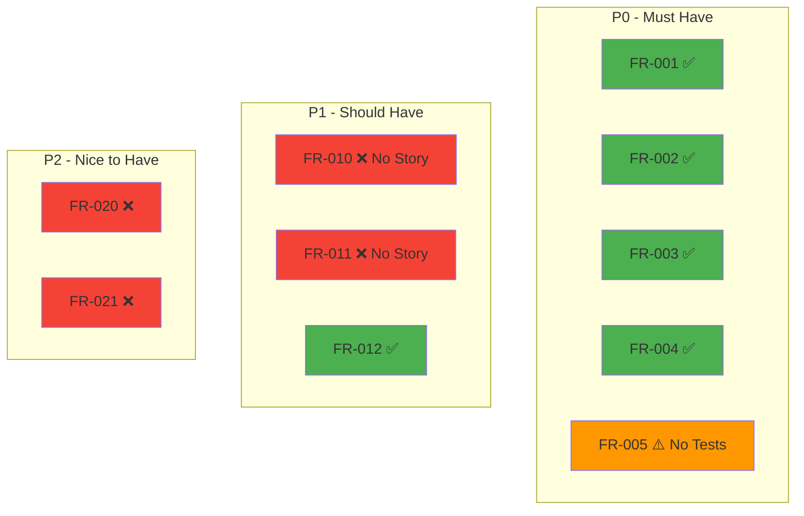

# /project:coverage-map

## Mission

Analyze requirement coverage across all project layers (stories, code, tests) and generate a visual coverage report highlighting gaps and suggesting next actions. This command provides a quick health check of project traceability.

## Prerequisites

- `project-management/prd.md` exists with FR-xxx requirement IDs
- `project-management/backlog/` contains user stories
- Codebase and test files (optional, for deeper analysis)

## Mode Plan

> **Le mode plan est obligatoire.** Avant l'exécution, Claude active le mode plan pour analyser le code impacté, proposer un plan d'implémentation et attendre votre validation avant toute modification.

## Workflow

### Step 1: Inventory Requirements

```
╔══════════════════════════════════════════════════════════╗
║              COVERAGE MAP - SCANNING                      ║
╠══════════════════════════════════════════════════════════╣
║ Building requirement inventory...                         ║
╚══════════════════════════════════════════════════════════╝
```

1. Parse `project-management/prd.md` for all FR-xxx entries
2. Categorize by priority: P0 (Must Have), P1 (Should Have), P2 (Nice to Have)
3. Count total requirements per priority level

### Step 2: Check Story Coverage

For each requirement FR-xxx:
1. Search user stories for `Implements:` references containing FR-xxx
2. Mark requirement as "Covered by Story" or "No Story"
3. Calculate story coverage percentage per priority level

### Step 3: Check Code Coverage

For each user story US-xxx that implements a requirement:
1. Search codebase for `// Story: US-xxx` references
2. Mark story as "Has Code" or "No Code"
3. Calculate code coverage percentage

### Step 4: Check Test Coverage

For each user story US-xxx with code:
1. Search test files for US-xxx or FR-xxx references
2. Mark story as "Has Tests" or "No Tests"
3. Calculate test coverage percentage

### Step 5: Generate Coverage Report

```
╔══════════════════════════════════════════════════════════╗
║              COVERAGE MAP GENERATED                       ║
╠══════════════════════════════════════════════════════════╣
║ Overall Coverage: {n}%                                    ║
╚══════════════════════════════════════════════════════════╝
```

## Output Format

### Table Format (default)

```
Requirement Coverage Map
========================

Overall Coverage
────────────────

| Layer | Covered | Total | Coverage | Status |
|-------|---------|-------|----------|--------|
| Stories | 8 | 10 | 80% | ⚠️ |
| Code | 7 | 8 | 87% | ⚠️ |
| Tests | 6 | 8 | 75% | ❌ |
| End-to-End | 6 | 10 | 60% | ❌ |

Coverage by Priority
────────────────────

| Priority | Requirements | Story Coverage | Code Coverage | Test Coverage |
|----------|-------------|----------------|---------------|---------------|
| P0 (Must Have) | 5 | 100% ✅ | 100% ✅ | 80% ⚠️ |
| P1 (Should Have) | 3 | 66% ⚠️ | 50% ❌ | 33% ❌ |
| P2 (Nice to Have) | 2 | 0% ❌ | 0% ❌ | 0% ❌ |

Uncovered Requirements
──────────────────────

| ID | Requirement | Priority | Missing |
|----|-------------|----------|---------|
| FR-005 | Bulk export | P0 | Tests |
| FR-010 | CSV import | P1 | Story, Code, Tests |
| FR-011 | PDF export | P1 | Story, Code, Tests |
| FR-020 | Analytics dashboard | P2 | Story, Code, Tests |
| FR-021 | Custom reports | P2 | Story, Code, Tests |

Recommended Actions
───────────────────

1. 🔴 CRITICAL: FR-005 (P0) has code but no tests — add test coverage
2. ⚠️ HIGH: FR-010, FR-011 (P1) have no stories — create user stories
3. 📝 LOW: FR-020, FR-021 (P2) not started — plan for future sprints

Next Commands
─────────────

- /project:trace --id FR-005      → Deep trace for specific requirement
- /project:add-story              → Create missing user stories
- /project:generate-backlog       → Regenerate backlog with gaps
```

### Mermaid Format (--format mermaid)



## Coverage Thresholds

| Threshold | Status | Action |
|-----------|--------|--------|
| >= 90% | ✅ Excellent | Maintain |
| 80-89% | ⚠️ Good | Review gaps |
| 60-79% | ⚠️ Needs Work | Prioritize coverage |
| < 60% | ❌ Critical | Immediate action required |

## Example Session

```
User: /project:coverage-map

Claude: Scanning requirement coverage...

📋 Found 10 requirements in PRD (5 P0, 3 P1, 2 P2)
📖 Checking story coverage... 80% (8/10)
💻 Checking code coverage... 87% (7/8)
🧪 Checking test coverage... 75% (6/8)

Requirement Coverage Map
========================
[... full report ...]

End-to-End Coverage: 60%

🔴 2 P0 requirements need attention
⚠️ 2 P1 requirements have no stories

User: /project:coverage-map --level test

Claude: Focusing on test coverage only...

Test Coverage Report
====================

| Story | Has Tests | Test Files | Test Count |
|-------|-----------|------------|------------|
| US-001 | ✅ | 2 files | 20 tests |
| US-002 | ✅ | 1 file | 6 tests |
| US-003 | ❌ | 0 files | 0 tests |
| US-004 | ✅ | 1 file | 8 tests |

Stories without tests: US-003 (Register with email)
Action: Create tests/RegistrationServiceTest.php

User: /project:coverage-map --format mermaid

Claude: [generates Mermaid coverage diagram]
```

## Related Commands

- `/project:trace` - Full bidirectional traceability matrix
- `/project:generate-prd` - Generate PRD with requirement IDs
- `/project:generate-backlog` - Create backlog from PRD
- `/project:update-stories` - Add missing fields to stories
