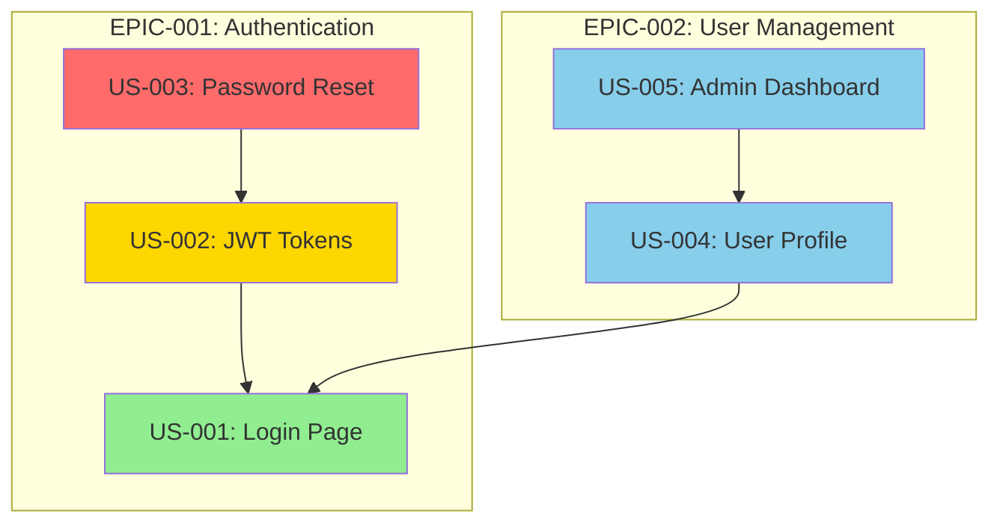

# /project:dependencies

## Mission

Generate a visual dependency graph showing relationships between user stories. Detect circular dependencies, identify bottleneck stories, and help optimize execution order.

## Prerequisites

- `project-management/backlog/` contains user stories with `Depends on:` fields
- Optional: `.bmad/sprint-status.yaml` for sprint context
- Optional: `project-management/prd.md` for epic grouping

## Mode Plan

> **Le mode plan est obligatoire.** Avant l'execution, Claude active le mode plan pour analyser le code impacte, proposer un plan d'implementation et attendre votre validation avant de realiser toute modification.

## Workflow

### Step 1: Load Stories

1. Scan `project-management/backlog/` for all story files
2. If `--sprint` is provided, filter to stories assigned to that sprint
3. Extract `Depends on:` fields from each story's Traceability section
4. Build adjacency list of dependencies

### Step 2: Validate Dependencies

1. Check for circular dependencies (A -> B -> C -> A)
2. Check for references to non-existent stories
3. Check for self-references
4. Report any issues found

### Step 3: Generate Graph

**Mermaid format (default):**



### Step 4: Analyze Dependencies

Generate analysis including:
- **Bottleneck stories**: Stories that block the most other stories
- **Independent stories**: Stories with no dependencies (can start anytime)
- **Dependency chains**: Longest chain of sequential dependencies
- **Parallel opportunities**: Groups of stories that can be worked in parallel

### Step 5: Output Report

```
+==========================================================+
|           STORY DEPENDENCY GRAPH                         |
+==========================================================+
| Sprint: Sprint-3 | Stories: 8 | Dependencies: 5          |
+==========================================================+
|                                                          |
| Bottleneck Stories (block 3+ others):                    |
|   !! US-001: Login Page (blocks 4 stories)               |
|                                                          |
| Independent Stories (no dependencies):                   |
|   OK US-006: Landing Page                                |
|   OK US-007: Error Pages                                 |
|                                                          |
| Longest Chain (3 steps):                                 |
|   US-001 -> US-002 -> US-003                             |
|                                                          |
| Parallel Groups:                                         |
|   Group 1: US-006, US-007 (independent)                  |
|   Group 2: US-004, US-005 (after US-001)                 |
|                                                          |
| Issues:                                                  |
|   OK No circular dependencies                            |
|   OK No missing references                               |
+==========================================================+
```

## Example Session

```
User: /project:dependencies --sprint=Sprint-3

Claude: Analyzing dependencies for Sprint-3...

Found 8 stories with 5 dependencies.

[Mermaid graph displayed]

Key findings:
- US-001 is a bottleneck (blocks 4 stories). Consider prioritizing it.
- US-006 and US-007 are independent and can start immediately.
- Critical path: US-001 -> US-002 -> US-003 (3 sprints if sequential)

Recommendation: Start with US-001 + US-006/US-007 in parallel.
```

## Related Commands

- `/project:critical-path` — Identify the critical path
- `/project:trace` — View traceability matrix
- `/sprint:next-story` — Get next story (considers dependencies)
- `/sprint:status` — View sprint progress
