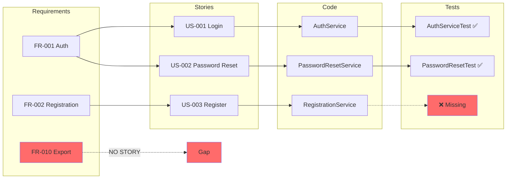

# /project:trace

## Mission

Generate a bidirectional traceability matrix that maps every requirement from the PRD through user stories, code implementation, and test coverage. This provides full visibility into what is implemented, what is tested, and what gaps exist.

## Prerequisites

- `project-management/prd.md` exists with FR-xxx requirement IDs
- `project-management/backlog/` contains user stories with `Implements:` references
- Codebase with `// Story: US-xxx` or `# Story: US-xxx` comments
- Test files with story/requirement references

## Mode Plan

> **Le mode plan est obligatoire.** Avant l'exécution, Claude active le mode plan pour analyser le code impacté, proposer un plan d'implémentation et attendre votre validation avant toute modification.

## Workflow

### Step 1: Scan PRD Requirements

```
╔══════════════════════════════════════════════════════════╗
║              TRACEABILITY SCAN - REQUIREMENTS             ║
╠══════════════════════════════════════════════════════════╣
║ Scanning project-management/prd.md...                     ║
╚══════════════════════════════════════════════════════════╝
```

Parse the PRD for all functional requirements:
1. Read `project-management/prd.md`
2. Extract all FR-xxx IDs from section 5 (Functional Requirements)
3. Record requirement text, priority (P0/P1/P2), and acceptance criteria
4. Build a requirements registry: `{FR-001: {text, priority, status}}`

### Step 2: Scan User Stories

Search for user stories referencing requirements:
1. Scan `project-management/backlog/` for `US-*.md` or `user-stories/` files
2. In each story, look for `Implements:` or `Traceability` section
3. Extract mappings: `{US-001: [FR-001, FR-003]}`
4. Record story status, sprint, and acceptance criteria count

### Step 3: Scan Codebase

Search for code files referencing stories:
1. Grep codebase for patterns: `// Story: US-xxx`, `# Story: US-xxx`, `@story US-xxx`
2. Record file paths and line numbers for each reference
3. Build mapping: `{US-001: [src/Service/OrderService.php:42, src/Controller/OrderController.php:15]}`
4. Identify code files with no story reference

### Step 4: Scan Tests

Search for test files referencing stories or requirements:
1. Grep test directories for `US-xxx` or `FR-xxx` references
2. Check test names for story/requirement patterns
3. Build mapping: `{US-001: [tests/OrderServiceTest.php, tests/OrderControllerTest.php]}`
4. Identify stories with no test coverage

### Step 5: Generate Traceability Matrix

Combine all mappings into a comprehensive matrix:

```
╔══════════════════════════════════════════════════════════╗
║              TRACEABILITY MATRIX GENERATED                ║
╠══════════════════════════════════════════════════════════╣
║ Requirements: {n} | Stories: {n} | Files: {n} | Tests: {n}║
╚══════════════════════════════════════════════════════════╝
```

## Output Format

### Table Format (default)

```
Bidirectional Traceability Matrix
=================================

Requirement → Story → Code → Tests
─────────────────────────────────────────────────────

FR-001 (P0) User Authentication
  ├── US-001: Login with email/password
  │   ├── src/Service/AuthService.php:25
  │   ├── src/Controller/AuthController.php:18
  │   ├── tests/AuthServiceTest.php ✅
  │   └── tests/AuthControllerTest.php ✅
  └── US-002: Password reset flow
      ├── src/Service/PasswordResetService.php:10
      └── tests/PasswordResetServiceTest.php ✅

FR-002 (P0) User Registration
  └── US-003: Register with email
      ├── src/Service/RegistrationService.php:12
      └── ⚠️ NO TESTS

FR-010 (P1) Export to CSV
  └── ⚠️ NO STORIES

Coverage Summary
================

| Level | Covered | Total | Percentage |
|-------|---------|-------|------------|
| Requirements → Stories | 8 | 10 | 80% |
| Stories → Code | 7 | 8 | 87% |
| Stories → Tests | 6 | 8 | 75% |
| End-to-End (FR → Test) | 6 | 10 | 60% |

Gaps Identified
===============

| Type | ID | Description | Action Needed |
|------|----|-------------|---------------|
| No Stories | FR-010 | Export to CSV | Create user story |
| No Tests | US-003 | Register with email | Add test coverage |
| No Code | US-005 | Bulk import | Implement feature |
```

### Mermaid Format (--format mermaid)



### JSON Format (--format json)

```json
{
  "generated_at": "2026-02-19T10:00:00Z",
  "requirements": {
    "FR-001": {
      "text": "User Authentication",
      "priority": "P0",
      "stories": ["US-001", "US-002"],
      "covered": true
    }
  },
  "stories": {
    "US-001": {
      "title": "Login with email/password",
      "implements": ["FR-001"],
      "code_files": ["src/Service/AuthService.php"],
      "test_files": ["tests/AuthServiceTest.php"],
      "covered": true
    }
  },
  "coverage": {
    "requirements_to_stories": 0.80,
    "stories_to_code": 0.87,
    "stories_to_tests": 0.75,
    "end_to_end": 0.60
  },
  "gaps": [
    {"type": "no_stories", "id": "FR-010", "description": "Export to CSV"},
    {"type": "no_tests", "id": "US-003", "description": "Register with email"}
  ]
}
```

## Example Session

```
User: /project:trace

Claude: Starting traceability scan...

📋 Scanning PRD requirements...
Found 10 requirements (5 P0, 3 P1, 2 P2)

📖 Scanning user stories...
Found 8 stories with requirement references

💻 Scanning codebase...
Found 24 code files with story references

🧪 Scanning tests...
Found 18 test files with story references

Bidirectional Traceability Matrix
=================================
[... full matrix output ...]

Coverage: 60% end-to-end
Gaps: 2 requirements without stories, 1 story without tests

User: /project:trace --scope requirement --id FR-001

Claude: Tracing FR-001: User Authentication

FR-001 (P0) User Authentication
├── US-001: Login with email/password [Done]
│   ├── src/Service/AuthService.php:25
│   ├── src/Controller/AuthController.php:18
│   ├── tests/AuthServiceTest.php ✅ (12 tests)
│   └── tests/AuthControllerTest.php ✅ (8 tests)
└── US-002: Password reset flow [In Progress]
    ├── src/Service/PasswordResetService.php:10
    └── tests/PasswordResetServiceTest.php ✅ (6 tests)

Status: Fully covered (2/2 stories, 3/3 code files, 3/3 test files)

User: /project:trace --format mermaid

Claude: [generates Mermaid diagram]
```

## Related Commands

- `/project:coverage-map` - Identify uncovered requirements
- `/project:generate-prd` - Generate PRD with requirement IDs
- `/project:generate-backlog` - Create backlog from PRD
- `/project:generate-tech-spec` - Generate technical specification
