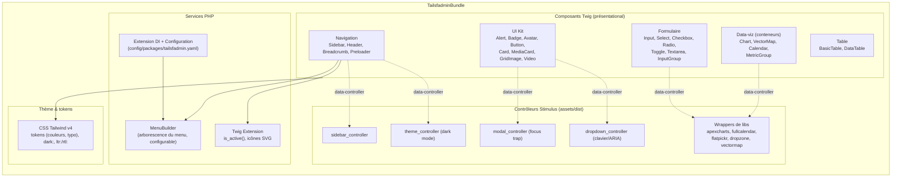

# C4 — Niveau 3 : Composants (TailsfadminBundle)

> Vue interne du bundle. Le détail exhaustif du mapping source → composant est dans `component-inventory.md`.

## Diagramme de composants

## Composants clés

| Composant | Type | Rôle | US |
|-----------|------|------|----|
| **UI Kit** (Alert, Badge, Avatar, Button, Card…) | Twig | Briques présentational thématisées | US-008 → US-013 |
| **Sidebar / Header / Breadcrumb / Preloader** | Twig + Stimulus | Chrome de navigation | US-004, US-006, US-007 |
| **Composants de formulaire** | Twig (+ Stimulus pour datepicker/upload) | Champs compatibles Symfony Forms | US-014 → US-016 |
| **Table** | Twig (+ Dropdown Stimulus) | Tables basiques et avancées | US-017 |
| **Conteneurs data-viz** (Chart, VectorMap, Calendar) | Twig + Stimulus (libs) | Points de montage des libs JS | US-018 → US-020 |
| **MenuBuilder** | Service PHP | Arborescence de menu configurable (calquée sur `MenuHelper`) | US-006 |
| **Twig Extension** | Service PHP | `is_active()`, rendu d'icônes SVG | US-006 |
| **theme_controller** | Stimulus | Dark mode persistant (localStorage) | US-005 |

## Principes appliqués

- **DIP** : les composants dépendent d'abstractions (MenuBuilder configurable, tokens) — pas de valeurs codées en dur côté démo.
- **SRP** : un contrôleur Stimulus = un comportement ; un Twig Component = un élément d'UI.
- **OCP** : nouvelles variantes/composants par ajout, layout et composants surchargeables (override de templates Twig, tokens CSS).
- **Séparation bundle/démo** : aucun composant ne dépend de l'app de démo.
