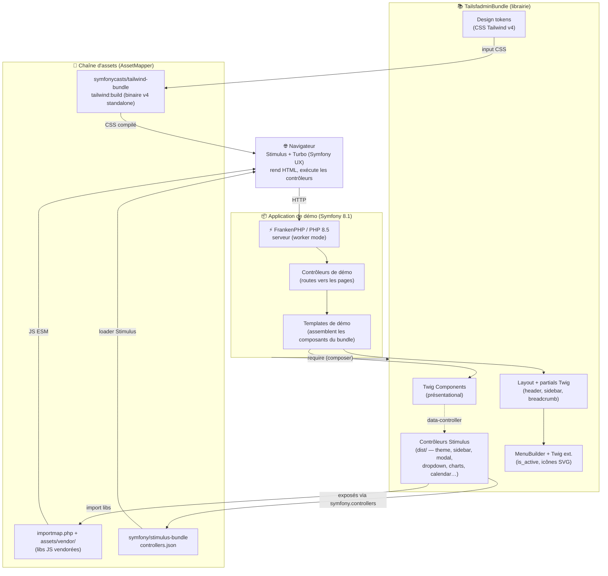

# C4 — Niveau 2 : Conteneurs

> Vue des « conteneurs » de tailsfadmin. Adaptée à un thème : pas de base de données ni d'API métier ; le cœur est la **chaîne d'assets** et la **frontière bundle / app de démo**.

## Diagramme de conteneurs

## Conteneurs

| Conteneur | Techno | Responsabilité |
|-----------|--------|----------------|
| **Application de démo** | Symfony 8.1 / FrankenPHP / PHP 8.5 | Héberge les routes et pages de démonstration ; ne contient **que de l'usage** du bundle |
| **TailsfadminBundle** | Bundle Symfony (PHP 8.5) | Fournit composants Twig, contrôleurs Stimulus, layout, MenuBuilder, tokens ; **réutilisable hors démo** |
| **Chaîne d'assets** | AssetMapper + tailwind-bundle + stimulus-bundle + importmap | Compile le CSS (Tailwind v4 sans Node), vendore et sert les libs JS, charge les contrôleurs Stimulus |
| **Navigateur** | Stimulus + Turbo | Exécute l'interactivité (convertie d'Alpine.js) |

## Décisions structurantes (détaillées en ADR)

- **ADR-001** : Tailwind v4 via `symfonycasts/tailwind-bundle` (binaire standalone, sans Node).
- **ADR-002** : structure monorepo bundle + app de démo.
- **ADR-003** : packaging des contrôleurs Stimulus et assets du bundle (convention UX `symfony.controllers`).
- **ADR-004** : conversion Alpine → Stimulus et encapsulation des libs JS.

## Flux de build (résumé)

1. `composer install` (app de démo tire `TailsfadminBundle` + bundles UX/Tailwind).
2. `php bin/console importmap:install` → vendore les libs JS dans `assets/vendor/`.
3. `php bin/console tailwind:build` → compile le CSS (tokens + composants) via le binaire v4.
4. `php bin/console asset-map:compile` (prod) → assets figés, servis par FrankenPHP.
