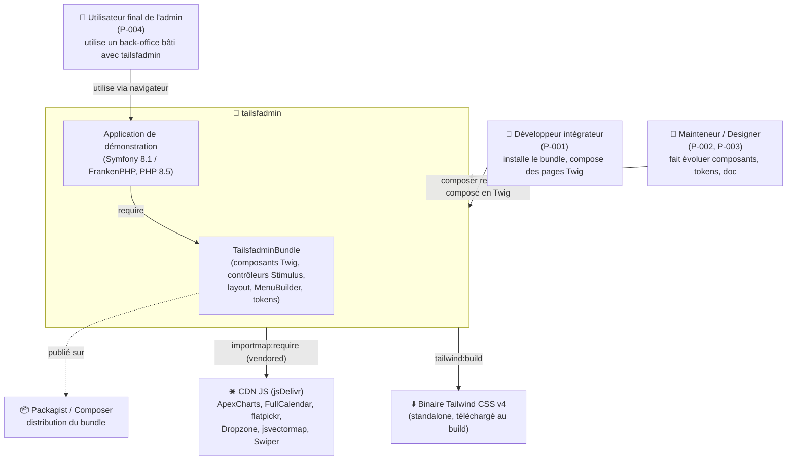

# C4 — Niveau 1 : Contexte système

> **tailsfadmin** — thème d'administration Symfony (bundle réutilisable + application de démo).
> Projet de type *thème/librairie UI* : pas de base de données métier ni d'API applicative. Les « acteurs externes » sont surtout des sources d'assets.

## Diagramme de contexte

## Acteurs

| Acteur | Rôle | Interaction |
|--------|------|-------------|
| **P-001** Développeur intégrateur | Consomme le bundle | Installe via Composer, compose des pages avec les composants Twig |
| **P-002 / P-003** Designer / Mainteneur | Fait évoluer le produit | Développe composants, tokens, documentation, CI |
| **P-004** Utilisateur final | Bénéficiaire indirect | Utilise un back-office construit avec le thème |

## Dépendances externes

| Dépendance | Usage | Note |
|------------|-------|------|
| **jsDelivr (CDN npm)** | Source des libs JS, *vendorées* localement via `importmap:require` | Aucune dépendance runtime au CDN : les fichiers sont téléchargés dans `assets/vendor/` et servis par l'app |
| **Binaire Tailwind v4 standalone** | Compilation CSS sans Node.js | Téléchargé et mis en cache par `symfonycasts/tailwind-bundle` |
| **Packagist** | Distribution du bundle | SemVer, voir US-026 |

## Frontières

- **Dans le système** : le bundle et l'app de démo.
- **Hors système** : tout backend métier réel (CRUD, entités de domaine), l'authentification de production (les pages auth sont de l'UI de démo — voir US-023).
