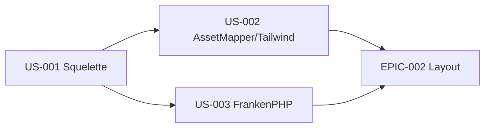

# EPIC-001 — Fondations & socle technique

**Statut :** 🔴 To Do · **Priorité :** Must · **Sprint cible :** Sprint 1

## Objectif

Établir la chaîne technique de bout en bout : monorepo **bundle Symfony réutilisable + application de démo**, intégration **AssetMapper + Tailwind v4**, exécution sous **FrankenPHP / PHP 8.5**. C'est le socle du *Walking Skeleton*.

## MMF (Minimum Marketable Feature)

Un développeur peut cloner le dépôt, lancer l'app de démo sous FrankenPHP, voir une page rendue avec Tailwind v4 opérationnel et les design tokens TailAdmin, le tout en s'appuyant sur un bundle installable séparément. La preuve que « ça tourne » est faite.

## User Stories

| ID | Titre | Points | Priorité |
|----|-------|--------|----------|
| US-001 | Squelette bundle + application de démo | 5 | Must |
| US-002 | Intégration AssetMapper + Tailwind v4 + design tokens | 8 | Must |
| US-003 | Exécution FrankenPHP / PHP 8.5 | 3 | Must |

**Total :** 16 points

## Dépendances

## Critères de succès

- App de démo démarrable, bundle installable (séparation nette).
- Tailwind v4 compile et sert le CSS via AssetMapper (ADR tranché).
- Tokens de couleurs/typo TailAdmin disponibles (clair + dark).

## Risques

- **Tailwind v4 ⇄ AssetMapper** : intégration non triviale → POC dès le Sprint 1, ADR dédié en phase Design.
