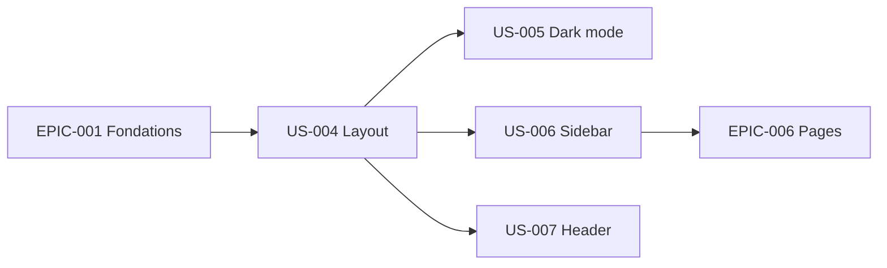

# EPIC-002 — Layout & navigation

**Statut :** 🔴 To Do · **Priorité :** Must · **Sprint cible :** Sprint 1-2

## Objectif

Fournir le *chrome* de l'admin : layout global (header, sidebar, zone de contenu, preloader, breadcrumb), **dark mode** persistant et **sidebar responsive** multi-niveaux, le tout en **Stimulus/UX** (conversion d'Alpine.js).

## MMF

Toute page de l'admin hérite d'un layout cohérent avec navigation latérale repliable/mobile, en-tête fonctionnel (recherche, dropdowns), fil d'Ariane et bascule clair/dark mémorisée.

## User Stories

| ID | Titre | Points | Priorité |
|----|-------|--------|----------|
| US-004 | Layout admin de base (header + sidebar + content + preloader) | 5 | Must |
| US-005 | Dark mode persistant (Stimulus) | 5 | Must |
| US-006 | Sidebar responsive multi-niveaux (collapse/mobile, item actif) | 8 | Must |
| US-007 | Header : recherche (Cmd/Ctrl+K), dropdowns user/notifications, breadcrumb | 8 | Should |

**Total :** 26 points

## Dépendances

## Critères de succès

- Layout réutilisable et surchargeable, dark mode cohérent partout.
- Sidebar calquée sur `MenuHelper` (périmètre réel), item actif mis en évidence, structure prête pour le **RTL**.
- Interactivité 100 % Stimulus (aucun Alpine.js résiduel).
