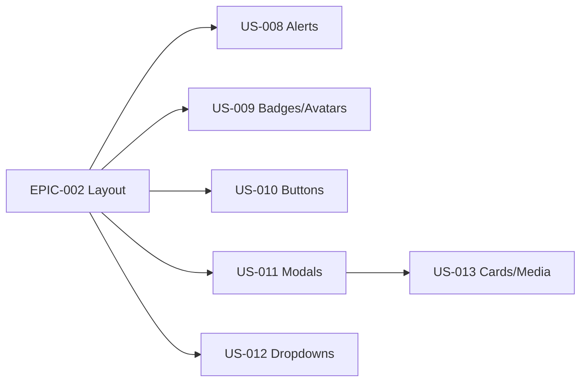

# EPIC-003 — Bibliothèque de composants UI

**Statut :** 🔴 To Do · **Priorité :** Must · **Sprint cible :** Sprint 2-3

## Objectif

Porter les composants UI TailAdmin en **Twig Components** idiomatiques, avec l'interactivité en **Stimulus** : alerts, badges, avatars, buttons, modals/overlays, dropdowns, cards/media/grid-images/videos.

## MMF

Un développeur compose ses écrans à partir d'une bibliothèque de composants Twig prêts à l'emploi (`<twig:...>`), accessibles et thématisés (clair/dark), fidèles à TailAdmin.

## User Stories

| ID | Titre | Points | Priorité |
|----|-------|--------|----------|
| US-008 | Composants Alerts (4 variantes) | 3 | Must |
| US-009 | Composants Badges & Avatars | 3 | Must |
| US-010 | Composants Buttons (6 variantes) | 3 | Must |
| US-011 | Modals / overlays accessibles (Stimulus) | 5 | Must |
| US-012 | Dropdowns accessibles (Stimulus) | 5 | Must |
| US-013 | Cards, media cards, grid images, videos | 5 | Should |

**Total :** 24 points

## Dépendances

## Critères de succès

- Chaque composant a une API claire (props/slots), documentée.
- Modals : focus trap + Échap ; dropdowns : navigation clavier + ARIA.
- Toutes les variantes des sources portées (voir inventaire).
