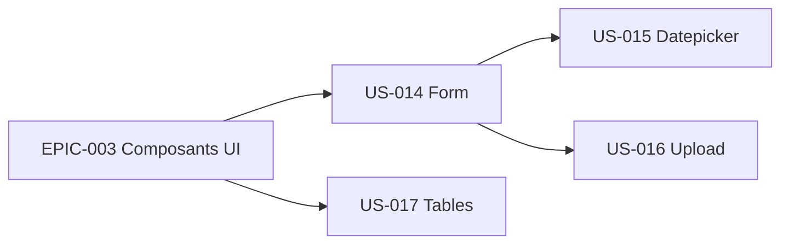

# EPIC-004 — Formulaires & tables

**Statut :** 🔴 To Do · **Priorité :** Must · **Sprint cible :** Sprint 3-4

## Objectif

Porter les composants de **formulaire** (inputs, select, checkbox/radio, toggle, textarea, états, groupes) et les **tables** (basiques et avancées), avec les intégrations **flatpickr** (datepicker) et **Dropzone** (upload) en Stimulus.

## MMF

Un développeur construit des formulaires riches et des tableaux de données fidèles à TailAdmin, avec datepicker et upload fonctionnels, sans écrire de JavaScript.

## User Stories

| ID | Titre | Points | Priorité |
|----|-------|--------|----------|
| US-014 | Composants de formulaire (inputs, select, checkbox/radio, toggle, textarea, états) | 8 | Must |
| US-015 | Datepicker (flatpickr) en Stimulus | 3 | Should |
| US-016 | Upload de fichiers (Dropzone) en Stimulus | 5 | Should |
| US-017 | Tables (basiques + avancées) | 5 | Should |

**Total :** 21 points

## Dépendances

## Critères de succès

- Composants de formulaire compatibles avec Symfony Forms (rendu/thème).
- flatpickr et Dropzone encapsulés en contrôleurs Stimulus réutilisables.
- Tables responsive, tri/dropdown d'actions fidèles aux sources.
