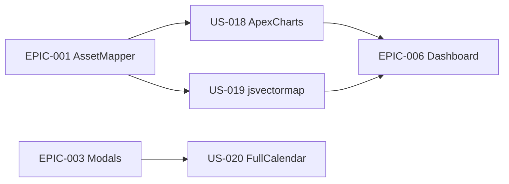

# EPIC-005 — Data-viz & calendrier

**Statut :** 🔴 To Do · **Priorité :** Should · **Sprint cible :** Sprint 4

## Objectif

Intégrer les librairies riches en **Stimulus/UX** : **ApexCharts** (courbes, barres, dashboard), **jsvectormap** (carte vectorielle) et **FullCalendar** (calendrier + modal d'événement).

## MMF

Le dashboard affiche des graphiques et une carte interactifs, et une page calendrier permet de visualiser/créer des événements — toutes ces intégrations étant encapsulées dans des contrôleurs Stimulus réutilisables.

## User Stories

| ID | Titre | Points | Priorité |
|----|-------|--------|----------|
| US-018 | Graphiques ApexCharts (line/bar/dashboard) en Stimulus | 8 | Must |
| US-019 | Carte vectorielle (jsvectormap) en Stimulus | 5 | Could |
| US-020 | Calendrier FullCalendar + modal d'événement en Stimulus | 8 | Should |

**Total :** 21 points

## Dépendances

## Critères de succès

- Contrôleurs Stimulus paramétrables (données via values/targets), dark-mode aware.
- Chargement des libs via importmap (pas de bundler externe).
- Rendu fidèle aux sources (chart-01..03, map-01, calendar-init).
