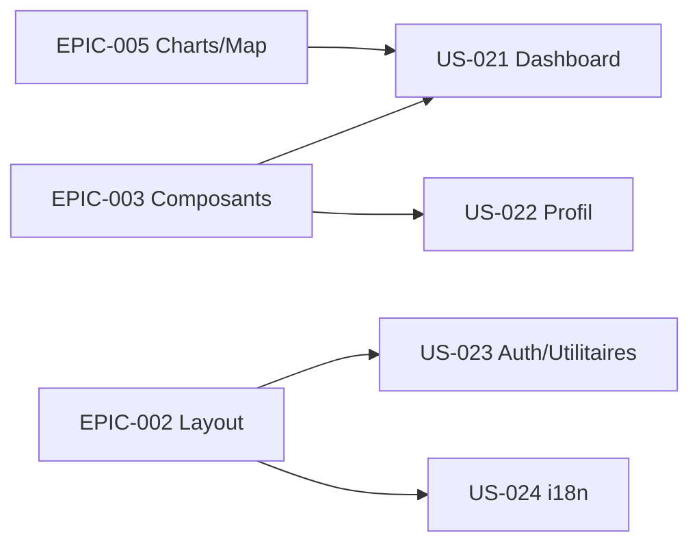

# EPIC-006 — Pages applicatives & i18n

**Statut :** 🔴 To Do · **Priorité :** Should · **Sprint cible :** Sprint 4-5

## Objectif

Assembler les **pages** de démonstration à partir des composants (dashboard e-commerce, profil, authentification, pages utilitaires) et fournir l'**internationalisation** (FR/EN, structure RTL pour l'arabe) avec sélecteur de langue.

## MMF

L'app de démo présente les pages phares de TailAdmin, entièrement composées à partir du bundle, disponibles en plusieurs langues avec bascule de locale (et support directionnel LTR/RTL).

## User Stories

| ID | Titre | Points | Priorité |
|----|-------|--------|----------|
| US-021 | Dashboard e-commerce (assemblage : métriques, cibles, ventes, commandes, carte) | 5 | Must |
| US-022 | Page profil + modals d'édition (infos, adresse) | 5 | Should |
| US-023 | Pages d'authentification + utilitaires (signin, signup, blank, 404) | 5 | Should |
| US-024 | i18n FR/EN + structure RTL + sélecteur de langue | 8 | Should |

**Total :** 23 points

## Dépendances

## Critères de succès

- Pages fidèles aux sources, composées uniquement via le bundle.
- Catalogues de traduction (absents des sources) recréés : `en`, `fr` (min.), structure prête pour `ar`/`es`/`de`.
- Sélecteur de langue persistant (session/cookie), gestion `dir` LTR/RTL.
