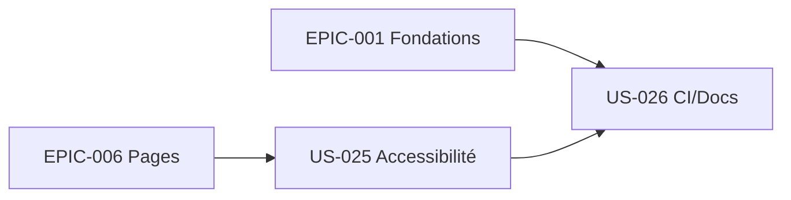

# EPIC-007 — Qualité, accessibilité & documentation

**Statut :** 🔴 To Do · **Priorité :** Must · **Sprint cible :** Transversal (Sprint 5)

## Objectif

Garantir la qualité produite : **accessibilité WCAG AA** transversale, **CI** (PHPStan max, tests, lint front) et **documentation** complète (installation, usage des composants, contribution) + CHANGELOG.

## MMF

Le bundle est livrable : accessible, testé, documenté et versionné. Un contributeur externe sait l'installer, l'utiliser et y contribuer ; la CI protège contre les régressions.

## User Stories

| ID | Titre | Points | Priorité |
|----|-------|--------|----------|
| US-025 | Accessibilité transversale (audit WCAG AA, clavier, ARIA, contrastes) | 5 | Must |
| US-026 | CI + documentation + CHANGELOG | 8 | Must |

**Total :** 13 points

## Dépendances

## Critères de succès

- Pages de démo conformes WCAG AA (clair + dark), navigation clavier complète.
- CI verte : PHPStan niveau max, tests ≥ 80 %, lint PHP + front.
- Documentation d'installation, catalogue de composants et guide de contribution publiés.
