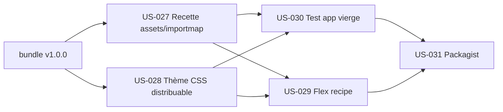

# EPIC-008 — Distribution & consommabilité du bundle

**Statut :** 🔴 To Do · **Priorité :** Must · **Sprint cible :** Sprint 8 (v2)

## Objectif

Rendre tailsfadmin **installable et immédiatement fonctionnel dans une application
Symfony vierge** (cible : projet **hottwos**), sans recopie manuelle. Aujourd'hui,
les entrées **importmap** (libs JS) et la recette **CSS Tailwind** vivent dans la
démo, pas dans le bundle : un consommateur obtient les templates/contrôleurs mais
doit reconstituer les assets à la main. Cet EPIC comble cet écart et publie le
bundle sur **Packagist** (canal de distribution retenu).

## MMF

Un développeur exécute `composer require tailsfadmin/tailsfadmin-bundle`, suit un
README court, et obtient une page d'admin stylée et interactive **sans copier
d'importmap ni de config Tailwind**. Le bundle est public sur Packagist.

## User Stories

| ID | Titre | Points | Priorité |
|----|-------|--------|----------|
| US-027 | Recette d'assets : le bundle expose ses entrées importmap (libs JS) via `prepend()` | 8 | Must |
| US-028 | Distribution du thème CSS Tailwind (tokens + `@source`) importable côté hôte, personnalisable | 5 | Must |
| US-029 | Flex recipe (config auto : bundles.php, `tailsfadmin.yaml`, importmap) | 5 | Should |
| US-030 | Test d'intégration dans une app Symfony vierge (CI) | 5 | Must |
| US-031 | Publication Packagist (public) + métadonnées de release | 3 | Must |

**Total :** 26 points

## Dépendances

## Critères de succès

- `composer require` sur une app vierge → page admin stylée + interactive **sans étape manuelle d'assets**.
- Les tokens/design Tailwind sont **personnalisables** par l'hôte (surcharge des variables).
- Un job CI **prouve** l'intégration dans une app Symfony neuve (pas seulement la démo monorepo).
- Le bundle est **résolvable via Packagist** (`composer require` sans déclarer de repository).

## Notes

- « Packagist d'abord » (décision) : Packagist est le canal ; publié une fois la
  consommabilité (US-027..030) verte, pour éviter une première impression cassée.
- Alternative temporaire pour hottwos avant publication : dépôt **VCS** + tag `v1.0.0`.
- À la publication : retirer le champ `version` de `composer.json` (les tags git font foi).
