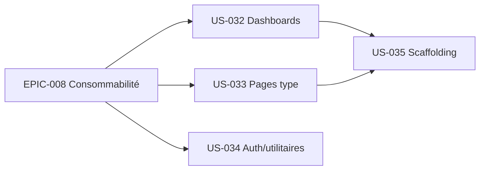

# EPIC-009 — Bibliothèque de pages d'exemples

**Statut :** 🔴 To Do · **Priorité :** Should · **Sprint cible :** Sprint 9-10 (v2)

## Objectif

Élargir le catalogue de **pages prêtes à l'emploi** (à la manière de TailAdmin Pro)
pour couvrir davantage de cas d'usage : plusieurs dashboards métier, des pages type
applicatives (settings, pricing, facture, kanban, chat, file manager, inbox), des
écrans d'auth/utilitaires supplémentaires, et un **scaffolding** pour générer une
page depuis un gabarit.

## MMF

La démo présente une **galerie de pages** couvrant les besoins courants d'un
back-office ; un développeur scaffolde une nouvelle page conforme au thème en une
commande.

## User Stories

| ID | Titre | Points | Priorité |
|----|-------|--------|----------|
| US-032 | Dashboards supplémentaires : Analytics, Marketing, CRM, SaaS | 8 | Should |
| US-033 | Pages type applicatives : Settings, Pricing, Invoice, Chat, File manager, Inbox | 8 | Should |
| US-034 | Auth & utilitaires étendus : reset password, 2FA/OTP, 500, maintenance, coming-soon, success | 5 | Could |
| US-035 | Scaffolding : commande `make:tailsfadmin-page` (gabarits) | 5 | Could |

**Total :** 26 points

## Dépendances

## Critères de succès

- Chaque page réutilise le bundle (assemblage), fidèle au style TailAdmin, clair+dark, accessible (WCAG AA), responsive.
- Les nouvelles pages sont couvertes par des tests fonctionnels + revue visuelle.
- Le scaffolding génère une page valide (route + template + éventuel contrôleur Stimulus).

## Notes

- Priorité après EPIC-008 : les pages n'ont d'intérêt largement réutilisable qu'une
  fois le bundle consommable par une app tierce.
- Réutiliser au maximum les composants existants ; n'ajouter de nouveaux composants
  bundle que si un motif se répète (règle des 3).
- **Kanban retiré d'US-033** (décision 2026-09-09) : porté par **US-040** (EPIC-010,
  sprint-011), spec de référence TailAdmin `/task-kanban` (live) — évite le doublon.
