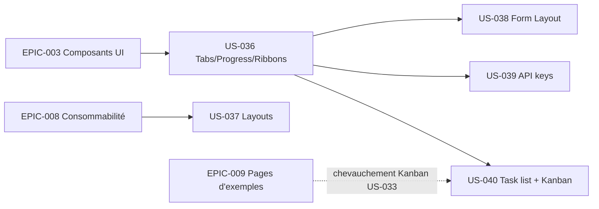

# EPIC-010 — Composants d'affichage & pages d'exemple avancées

**Statut :** 🟢 Done · **Priorité :** Could · **Sprint :** 11 (livré v1.3.0, 2026-09-09)

## Objectif

Enrichir le thème de **trois composants d'affichage** réutilisables (Tabs, Progress
bars, Ribbons) et d'un **jeu de pages de référence** supplémentaires (six variantes
de layout admin, une page de gabarit de formulaire, une page Integrations / clés
d'API, et deux vues de gestion de tâches — liste et Kanban). Les composants sont
fournis par le bundle ; les pages les assemblent, à la manière de TailAdmin.

## MMF

La démo présente Tabs, Progress bars et Ribbons comme composants `<twig:tsf:… />`
du bundle, **et** une galerie de pages de référence (6 layouts, form-layout,
Integrations/API keys, task list + Kanban) — fidèles TailAdmin, clair/dark,
accessibles (WCAG AA), responsive.

## Objectifs business

- Couvrir des motifs d'UI courants encore manquants (onglets, jauges de progression,
  rubans) pour réduire le code custom côté intégrateur.
- Fournir des gabarits de pages prêts à copier (layouts, formulaire, intégrations,
  tâches) accélérant le démarrage d'un back-office.

## User Stories

| ID | Titre | Points | Priorité | Réf. TailAdmin |
|----|-------|--------|----------|----------------|
| US-036 | Composants d'affichage : Tabs, Progress bars, Ribbons | 8 | Could | [tabs](https://demo.tailadmin.com/tabs) · [progress-bar](https://demo.tailadmin.com/progress-bar) · [ribbons](https://demo.tailadmin.com/ribbons) |
| US-037 | Layouts d'exemple supplémentaires (6 variantes de shell admin) | 8 | Could | [layout-one](https://demo.tailadmin.com/layout-one) → [layout-six](https://demo.tailadmin.com/layout-six) |
| US-038 | Page « Form Layout » (gabarit de mise en page de formulaire) | 3 | Could | [form-layout](https://demo.tailadmin.com/form-layout) |
| US-039 | Page « Integrations / API keys » (gestion des clés d'API) | 5 | Could | [api-keys](https://demo.tailadmin.com/api-keys) |
| US-040 | Pages Task list : format liste + format Kanban | 8 | Could | [sales](https://demo.tailadmin.com/sales) · [task-kanban](https://demo.tailadmin.com/task-kanban) |

**Total : 32 points**

## Dépendances

## Critères de succès

- [ ] Tabs, Progress bars, Ribbons livrés comme composants `<twig:tsf:… />` documentés
      (props, slots), avec revue visuelle clair/dark et tests.
- [ ] Les 6 variantes de layout sont accessibles dans la démo et **réutilisent** le
      layout admin existant (pas de duplication du shell).
- [ ] Les pages Form Layout, API keys, Task list (liste + Kanban) rendent 200, sont
      responsive, accessibles (WCAG AA), clair/dark.
- [ ] Réutilisation maximale des composants existants ; nouveaux composants bundle
      limités à Tabs/Progress/Ribbons (règle des 3).

## Notes

- **Références visuelles** : TailAdmin (URLs ci-dessus). Port fidèle, **sans CDN**
  (cohérent ADR-004/006) ; assets vendorés localement si dépendance JS (via
  `tailsfadmin:assets:install`).
- **Chevauchement Kanban** : un Kanban figure déjà dans US-033 (EPIC-009) ; US-040 le
  consolide — arbitrer au raffinage pour éviter le doublon.
- **Form Layout** recoupe EPIC-004 (formulaires) : ici c'est une **page-gabarit
  d'assemblage**, pas de nouveaux widgets de formulaire.
- Les 6 « layouts » TailAdmin sont surtout des **variantes d'agencement du shell**
  (position sidebar/header, largeur) : une US, 6 variantes documentées.
- Priorité **Could** : après le cœur v2 (distribution EPIC-008 livrée, pages EPIC-009).

---

**Créé le :** 2026-09-09 · **Mis à jour :** 2026-09-09
