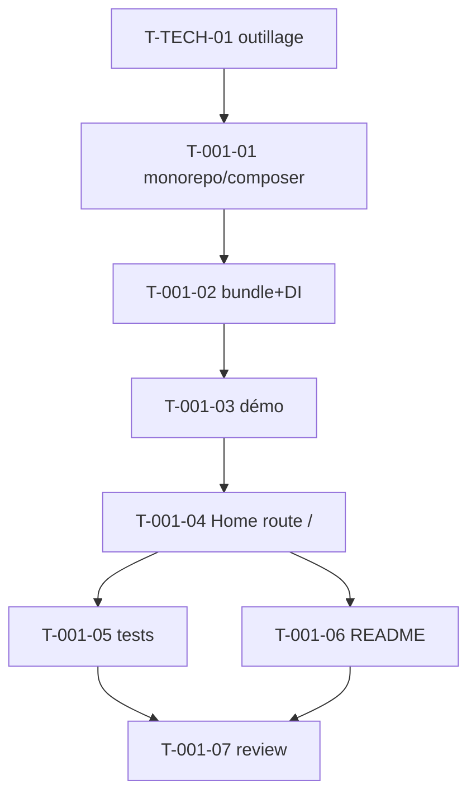

# Tâches — US-001 : Squelette bundle réutilisable + application de démo

## Informations US
- **Epic** : EPIC-001-fondations-socle-technique
- **Persona** : P-001 (Développeur intégrateur), P-003 (Mainteneur)
- **Story Points** : 5
- **Sprint** : sprint-001-walking_skeleton

## Résumé
**En tant que** développeur intégrateur / mainteneur **je veux** un dépôt distinguant le bundle réutilisable de l'app de démo **afin de** livrer tailsfadmin comme package installable.

> **Note d'alignement (ADR-002)** : le layout retenu place le **bundle à la racine** (`src/`, `config/`, `templates/`, `assets/`, `package.json`) et l'**app de démo** dans `demo/`. Ceci **supersede** la mention illustrative `bundle/` des critères Gherkin de l'US (le « quoi » — isolation stricte — reste identique).

## Vue d'ensemble des tâches

| ID | Type | Tâche | Est. | Dépend de | Statut |
|----|------|-------|------|-----------|--------|
| T-001-01 | [OPS] | Init monorepo + `composer.json` du bundle | 2h | T-TECH-01 | 🔲 |
| T-001-02 | [BE] | Classe bundle `AbstractBundle` + Extension DI + `services.yaml` | 3h | T-001-01 | 🔲 |
| T-001-03 | [OPS] | App de démo `demo/` + path repository + `bundles.php` | 3h | T-001-02 | 🔲 |
| T-001-04 | [FE-WEB] | `HomeController` démo + route `/` + template minimal | 1h | T-001-03 | 🔲 |
| T-001-05 | [TEST] | Test fonctionnel `/` → 200 + smoke `debug:container` | 2h | T-001-04 | 🔲 |
| T-001-06 | [DOC] | README (structure, règle d'isolation, install) | 1h | T-001-04 | 🔲 |
| T-001-07 | [REV] | Code review US-001 | 1h | T-001-05, T-001-06 | 🔲 |

**Total : 13h**

---

## Détail

### T-001-01 · [OPS] Init monorepo + composer.json du bundle — 2h
**Fichiers** : `composer.json`, `.gitignore`, `.gitattributes`
**Critères** :
- [ ] `composer.json` : `type: symfony-bundle`, autoload PSR-4 `Tailsfadmin\ → src/`, keyword `symfony-ux`, require `php: >=8.5`, `symfony/framework-bundle: ^8.1`.
- [ ] `.gitattributes` : `demo/ export-ignore`, `tests/ export-ignore`, `docs/ export-ignore`.
- [ ] Arborescence créée : `src/`, `config/`, `templates/`, `assets/`, `demo/`, `tests/`.

### T-001-02 · [BE] Classe bundle + Extension DI — 3h
**Fichiers** : `src/TailsfadminBundle.php`, `src/DependencyInjection/TailsfadminExtension.php`, `config/services.yaml`
**Critères** :
- [ ] `TailsfadminBundle extends AbstractBundle`.
- [ ] Extension charge `config/services.yaml` (au moins un service `tailsfadmin.*`).
- [ ] `debug:container tailsfadmin` liste ≥ 1 service (scénario alt US-001).

### T-001-03 · [OPS] App de démo — 3h
**Fichiers** : `demo/composer.json` (path repository → `../`), `demo/config/bundles.php`, structure Symfony 8.1 minimale
**Critères** :
- [ ] `composer install` dans `demo/` réussit et tire le bundle en local.
- [ ] `TailsfadminBundle` activé dans `demo/config/bundles.php`.
- [ ] `cache:warmup` sans erreur.

### T-001-04 · [FE-WEB] HomeController + route `/` — 1h
**Fichiers** : `demo/src/Controller/HomeController.php`, `demo/templates/home/index.html.twig`
**Critères** :
- [ ] Route `/` → HTTP 200, HTML contient « tailsfadmin ».
- [ ] Aucun log d'erreur dans `var/log/dev.log`.

### T-001-05 · [TEST] Test fonctionnel + smoke — 2h
**Fichiers** : `tests/Functional/HomeTest.php`
**Critères** :
- [ ] `GET /` → 200 et contient « tailsfadmin ».
- [ ] Test/smoke : le bundle est reconnu par le kernel (service listé).
- [ ] TDD : test écrit avant l'implémentation de T-001-04.

### T-001-06 · [DOC] README — 1h
**Fichiers** : `README.md`
**Critères** :
- [ ] Structure monorepo documentée + **règle d'isolation bundle/démo** (aucun code réutilisable dans `demo/`).
- [ ] Étapes d'installation (dev) et de consommation via path repository.

### T-001-07 · [REV] Code review — 1h
**Critères** : code lisible, PHPStan max OK, tests verts, isolation respectée.

## Graphe de dépendances

