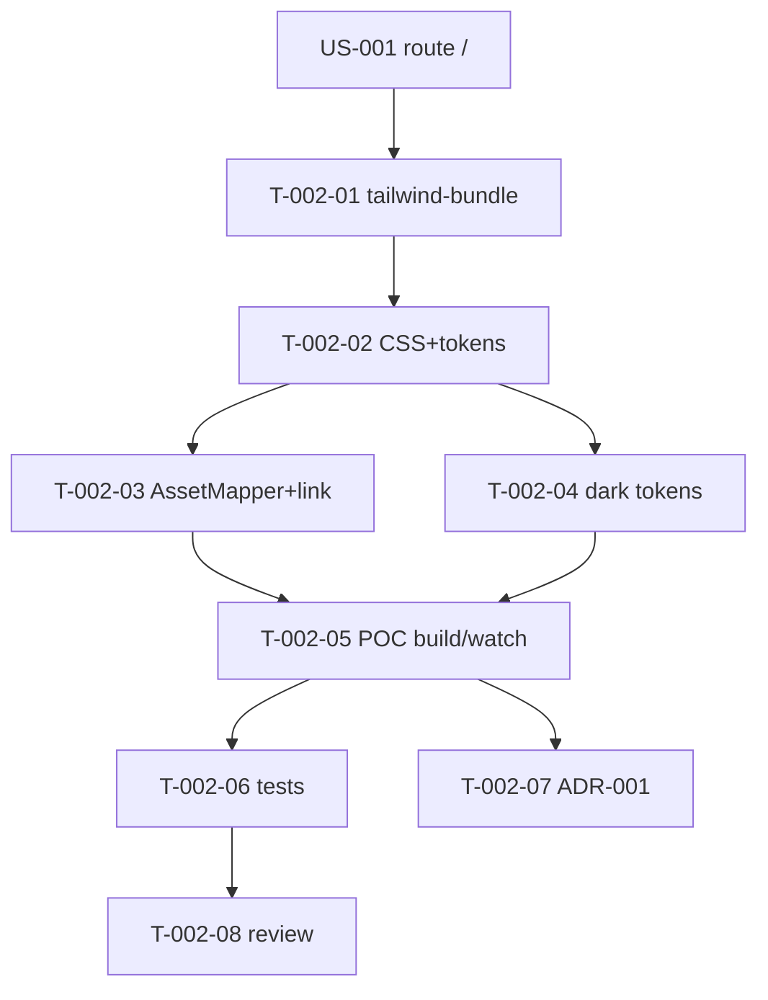

# Tâches — US-002 : AssetMapper + Tailwind CSS v4 + design tokens

## Informations US
- **Epic** : EPIC-001-fondations-socle-technique
- **Persona** : P-001 (Développeur), P-002 (Designer)
- **Story Points** : 8
- **Sprint** : sprint-001-walking_skeleton

## Résumé
**En tant que** développeur / designer **je veux** Tailwind v4 compilé et servi via AssetMapper avec les tokens TailAdmin (clair/dark) **afin de** bâtir tous les composants sur une base CSS cohérente.

> **⚠️ POC prioritaire (jour 1)** — point le plus risqué du sprint. « Comment » aligné sur **ADR-001** : `symfonycasts/tailwind-bundle` (binaire v4 standalone, **sans Node**), config CSS-first. Ceci supersede la piste « watcher / AssetPackage » évoquée dans l'US.

## Vue d'ensemble des tâches

| ID | Type | Tâche | Est. | Dépend de | Statut |
|----|------|-------|------|-----------|--------|
| T-002-01 | [OPS] | Installer tailwind-bundle + `tailwind:init` + épingler `binary_version` 4.x | 2h | T-001-04 | 🔲 |
| T-002-02 | [FE-WEB] | Porter `style.css` → `assets/styles/app.css` (@import, @plugin, @theme tokens) | 4h | T-002-01 | 🔲 |
| T-002-03 | [FE-WEB] | Exposer les assets du bundle à AssetMapper + `<link>` dans le layout démo | 3h | T-002-02 | 🔲 |
| T-002-04 | [FE-WEB] | Tokens dark mode sous `.dark` (brand/gray) | 2h | T-002-02 | 🔲 |
| T-002-05 | [OPS] | POC bout en bout : `tailwind:build` + `asset-map:compile` + `--watch` dev | 2h | T-002-03 | 🔲 |
| T-002-06 | [TEST] | Tests : CSS compilé présent, contient `.dark`, page `/` sans 404 CSS | 3h | T-002-05 | 🔲 |
| T-002-07 | [DOC] | Compléter ADR-001 (version binaire exacte, commandes réelles) | 1h | T-002-05 | 🔲 |
| T-002-08 | [REV] | Code review US-002 | 1h | T-002-06 | 🔲 |

**Total : 18h**

---

## Détail

### T-002-01 · [OPS] Installer tailwind-bundle — 2h
**Fichiers** : `demo/config/packages/tailwind.yaml`, `demo/composer.json`
**Critères** :
- [ ] `composer require symfonycasts/tailwind-bundle` + `bin/console tailwind:init`.
- [ ] **`binary_version` épinglé sur une 4.x** (⚠️ défaut = 3.4.17).
- [ ] `tailwind:build` s'exécute sans erreur (page vide).
**Commandes** : `bin/console tailwind:build`

### T-002-02 · [FE-WEB] Porter le CSS source + tokens — 4h
**Source** : `Tools/sources/tailadmin-free-tailwind-dashboard-template-main/src/css/style.css`
**Fichiers** : `assets/styles/app.css` (bundle)
**Critères** :
- [ ] `@import "tailwindcss";` + `@plugin "@tailwindcss/forms";`.
- [ ] Tokens couleurs `--color-brand-*`, gris, typographie en `@theme { }`.
- [ ] Fidélité aux valeurs de `style.css`.

### T-002-03 · [FE-WEB] Exposer les assets + link — 3h
**Fichiers** : `config/services.yaml` (asset path bundle), `demo/config/packages/asset_mapper.yaml`, layout démo
**Critères** :
- [ ] AssetMapper connaît le CSS du bundle (input Tailwind = `assets/styles/app.css`).
- [ ] Le layout charge la feuille via `asset()` / importmap.
- [ ] Page `/` : CSS chargé depuis `/assets/styles/app-*.css`, **0 erreur 404** (scénario nominal US-002).

### T-002-04 · [FE-WEB] Tokens dark mode — 2h
**Critères** :
- [ ] Variables sous `.dark { --color-* }` (stratégie classe sur `<html>`, cohérente US-005).
- [ ] Après `asset-map:compile`, le fichier compilé contient les déclarations `.dark`.

### T-002-05 · [OPS] POC bout en bout — 2h
**Critères** :
- [ ] `tailwind:build` → CSS dans `public/assets/` ; `asset-map:compile` OK (prod).
- [ ] En dev, `tailwind:build --watch` : ajout de `bg-brand-500` dans un Twig visible **sans rebuild manuel** (scénario alt US-002).
- [ ] Chaîne prouvée : **binaire v4 → CSS → AssetMapper → rendu**.

### T-002-06 · [TEST] Tests build & rendu — 3h
**Fichiers** : `tests/Functional/AssetPipelineTest.php`
**Critères** :
- [ ] Assert : fichier CSS compilé présent après build.
- [ ] Assert : le CSS compilé contient `.dark`.
- [ ] `GET /` : la balise `<link>` du CSS est présente ; pas de 404.

### T-002-07 · [DOC] Finaliser ADR-001 — 1h
**Critères** : version exacte du binaire v4 épinglée, commandes réelles, résolution d'éventuel conflit de version (scénario erreur US-002).

### T-002-08 · [REV] Code review — 1h

## Graphe de dépendances

