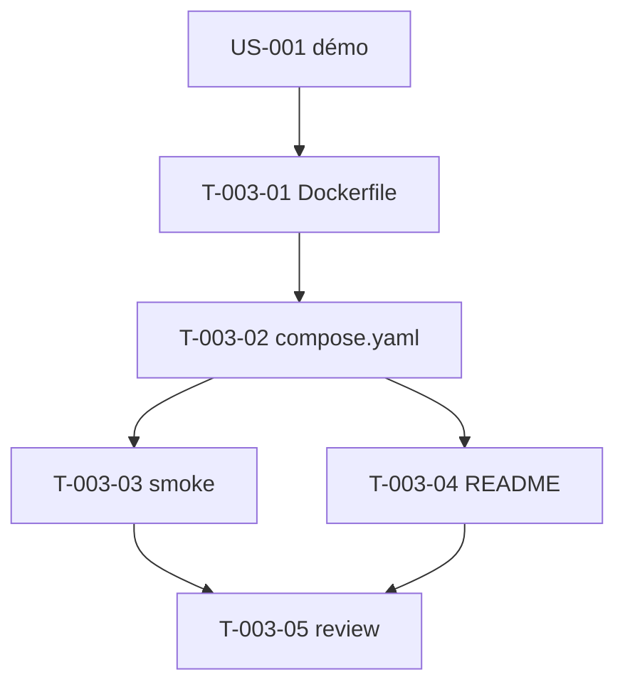

# Tâches — US-003 : Runtime FrankenPHP / PHP 8.5

## Informations US
- **Epic** : EPIC-001-fondations-socle-technique
- **Persona** : P-003 (Mainteneur)
- **Story Points** : 3
- **Sprint** : sprint-001-walking_skeleton

## Résumé
**En tant que** mainteneur **je veux** lancer la démo sous FrankenPHP/PHP 8.5 via Docker Compose **afin de** garantir un environnement reproductible (local = CI).

> Indépendant du CSS → peut avancer **en parallèle** de US-002.

## Vue d'ensemble des tâches

| ID | Type | Tâche | Est. | Dépend de | Statut |
|----|------|-------|------|-----------|--------|
| T-003-01 | [OPS] | Dockerfile multi-stage `dunglas/frankenphp:php8.5` | 3h | T-001-03 | 🔲 |
| T-003-02 | [OPS] | `compose.yaml` (ports, SERVER_NAME, volumes, healthcheck) | 2h | T-003-01 | 🔲 |
| T-003-03 | [TEST] | Smoke : `up` → healthy + `/`=200 + `php -v` = 8.5 | 2h | T-003-02 | 🔲 |
| T-003-04 | [DOC] | README Docker (ports, offline pré-pull) | 1h | T-003-02 | 🔲 |
| T-003-05 | [REV] | Code review US-003 | 0.5h | T-003-03, T-003-04 | 🔲 |

**Total : 8.5h**

---

## Détail

### T-003-01 · [OPS] Dockerfile — 3h
**Fichiers** : `demo/Dockerfile`
**Critères** :
- [ ] Base `dunglas/frankenphp:php8.5`, extensions PHP nécessaires (intl, opcache…).
- [ ] Multi-stage (composer install, assets compilés).
- [ ] PHPStan max OK sur le code du bundle (aucune régression).

### T-003-02 · [OPS] compose.yaml — 2h
**Fichiers** : `compose.yaml`
**Critères** :
- [ ] Service `demo`, ports 80/443, `SERVER_NAME`.
- [ ] Volumes `var/`, `public/`.
- [ ] Healthcheck `curl -f http://localhost/ || exit 1`.
- [ ] Commentaire expliquant comment changer le port hôte (scénario erreur US-003).

### T-003-03 · [TEST] Smoke Docker — 2h
**Fichiers** : `tests/smoke/docker-smoke.sh` (ou doc de vérification)
**Critères** :
- [ ] `docker compose up --build -d` → conteneur `healthy`.
- [ ] `curl -w '%{http_code}' http://localhost/` = `200`.
- [ ] `docker compose exec demo php -v` contient « PHP 8.5 » + FrankenPHP.

### T-003-04 · [DOC] README Docker — 1h
**Critères** : commandes `up/down`, changement de port, **pré-pull image** pour mode hors-ligne (scénario erreur US-003).

### T-003-05 · [REV] Code review — 0.5h

## Graphe de dépendances

