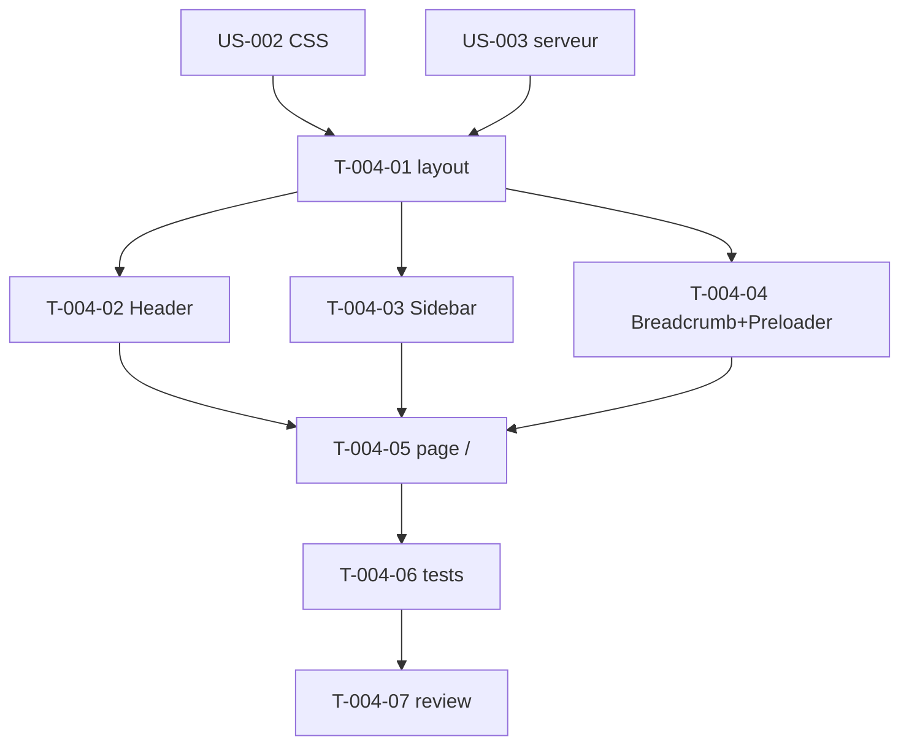

# Tâches — US-004 : Layout admin de base

## Informations US
- **Epic** : EPIC-002-layout-navigation
- **Persona** : P-001 (Développeur), P-004 (Utilisateur)
- **Story Points** : 5
- **Sprint** : sprint-001-walking_skeleton

## Résumé
**En tant que** développeur / utilisateur **je veux** un layout (header + sidebar + contenu + preloader + breadcrumb) **afin de** disposer d'une structure Twig réutilisable dont héritent toutes les pages.

> Header/Sidebar sont **statiques** à ce stade (l'interactivité vient en US-006/US-007). Composants Twig préfixés **`tsf`** (ADR-003).

## Vue d'ensemble des tâches

| ID | Type | Tâche | Est. | Dépend de | Statut |
|----|------|-------|------|-----------|--------|
| T-004-01 | [FE-WEB] | Layout `@Tailsfadmin/layout/admin.html.twig` (blocs + main#main-content + skip-link) | 3h | T-002-03, T-003-02 | 🔲 |
| T-004-02 | [FE-WEB] | Composant `tsf:Layout:Header` (statique, SVG, emplacement toggle) | 2h | T-004-01 | 🔲 |
| T-004-03 | [FE-WEB] | Composant `tsf:Layout:Sidebar` (statique, sections MENU/OTHERS) | 3h | T-004-01 | 🔲 |
| T-004-04 | [FE-WEB] | Breadcrumb + Preloader (Twig) + contrôleur Stimulus `preloader` | 2h | T-004-01, T-TECH-04 | 🔲 |
| T-004-05 | [FE-WEB] | Page démo `/` étendant le layout + breadcrumb « Dashboard » | 1h | T-004-02, T-004-03, T-004-04 | 🔲 |
| T-004-06 | [TEST] | Tests : header/aside/main#main-content, preloader, breadcrumb, skip-link | 3h | T-004-05 | 🔲 |
| T-004-07 | [REV] | Code review US-004 | 1h | T-004-06 | 🔲 |

**Total : 15h**

---

## Détail

### T-004-01 · [FE-WEB] Layout Twig — 3h
**Source** : `src/partials/{header,sidebar,preloader,breadcrumb}.html`
**Fichiers** : `templates/layout/admin.html.twig`
**Critères** :
- [ ] Blocs ``, ``, ``, ``, ``.
- [ ] `<main id="main-content">` + **skip-link** « Aller au contenu principal ».
- [ ] Classes Tailwind fidèles (marges, hauteurs, z-index).

### T-004-02 · [FE-WEB] Composant Header — 2h
**Fichiers** : `src/Twig/Components/Layout/Header.php` (+ template), `templates/components/...`
**Critères** :
- [ ] `<header class="header">` porté de `header.html`, SVG inline.
- [ ] Emplacement réservé pour le bouton theme-toggle (US-005).

### T-004-03 · [FE-WEB] Composant Sidebar (statique) — 3h
**Critères** :
- [ ] `<aside class="sidebar">` avec sections `MENU` / `OTHERS`.
- [ ] Structure prête pour `ltr:/rtl:` (anticipation RTL) et pour l'interactivité US-006 (pas d'Alpine).

### T-004-04 · [FE-WEB] Breadcrumb + Preloader — 2h
**Fichiers** : composants Twig + `assets/controllers/preloader_controller.js`
**Critères** :
- [ ] Preloader présent dans le DOM, **masqué au `window.load`** via Stimulus.
- [ ] Breadcrumb rend « Dashboard » en premier item.

### T-004-05 · [FE-WEB] Page démo `/` — 1h
**Critères** : la page étend le layout, définit ``, breadcrumb « Dashboard ».

### T-004-06 · [TEST] Tests — 3h
**Fichiers** : `tests/Functional/LayoutTest.php`
**Critères** :
- [ ] Présence `<header class=header>`, `<aside class=sidebar>`, `<main id=main-content>`.
- [ ] Preloader présent dans le DOM.
- [ ] Skip-link vérifiable (présence + cible `#main-content`).
- [ ] Héritage : une page fille injecte son contenu sans dupliquer le chrome.

### T-004-07 · [REV] Code review — 1h

## Graphe de dépendances

