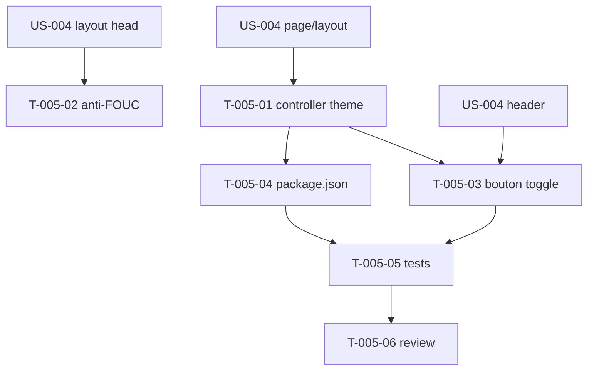

# Tâches — US-005 : Bascule clair/dark persistante (Stimulus)

> ⚠️ **DÉPLACÉE EN SPRINT 2** (ajustement de charge du 2026-09-07). Hors périmètre du Sprint 1. La tâche de packaging des contrôleurs (ex-T-005-04) a été remontée en **T-TECH-04** (Sprint 1) car nécessaire au preloader d'US-004. Ce fichier reste la référence de décomposition pour le Sprint 2.

## Informations US
- **Epic** : EPIC-002-layout-navigation
- **Persona** : P-002 (Designer), P-004 (Utilisateur)
- **Story Points** : 5
- **Sprint** : sprint-001-walking_skeleton

## Résumé
**En tant que** designer / utilisateur **je veux** une bascule clair/sombre persistante **afin de** conserver ma préférence entre les rechargements.

> Conversion **Alpine.js → Stimulus** du `theme-toggle` Laravel (ADR-004). Contrôleur exposé par le bundle via `package.json`/`symfony.controllers` (ADR-003). Variable d'ajustement du sprint (voir README).

## Vue d'ensemble des tâches

| ID | Type | Tâche | Est. | Dépend de | Statut |
|----|------|-------|------|-----------|--------|
| T-005-01 | [FE-WEB] | Contrôleur Stimulus `theme` (localStorage, `.dark`, toggle, prefers-color-scheme) | 3h | T-004-05 | 🔲 |
| T-005-02 | [FE-WEB] | Script inline anti-FOUC (<200o) dans `<head>` | 1h | T-004-01 | 🔲 |
| T-005-03 | [FE-WEB] | Bouton toggle (SVG soleil/lune) dans le header, câblé | 2h | T-005-01, T-004-02 | 🔲 |
| T-005-04 | [FE-WEB] | Exposer `theme` via `package.json` (`symfony.controllers`) + vérif auto-enregistrement | 2h | T-005-01 | 🔲 |
| T-005-05 | [TEST] | Tests : toggle `.dark`, persistance, dégradation localStorage bloqué | 3h | T-005-03, T-005-04 | 🔲 |
| T-005-06 | [REV] | Code review US-005 | 1h | T-005-05 | 🔲 |

**Total : 12h**

---

## Détail

### T-005-01 · [FE-WEB] Contrôleur Stimulus `theme` — 3h
**Source** : `Tools/sources/tailadmin-laravel-main/.../components/common/theme-toggle`
**Fichiers** : `assets/controllers/theme_controller.js`
**Critères** :
- [ ] Lit `localStorage.theme` à l'init ; applique/retire `.dark` sur `<html>`.
- [ ] Clic → bascule + persiste (`dark`/`light`).
- [ ] Fallback `prefers-color-scheme` si aucune préférence stockée.
- [ ] `try/catch` autour de `localStorage` (dégradation gracieuse).

### T-005-02 · [FE-WEB] Script anti-FOUC — 1h
**Fichiers** : `<head>` du layout (`admin.html.twig`)
**Critères** :
- [ ] Script inline **< 200 o**, bloquant, applique `.dark` **avant le premier paint**.
- [ ] Indépendant de Stimulus.
- [ ] Aucun flash clair au rechargement en mode sombre.

### T-005-03 · [FE-WEB] Bouton toggle — 2h
**Source** : SVG soleil/lune de `src/partials/header.html`
**Critères** :
- [ ] Bouton dans le header, `data-controller`/`data-action` vers `theme`.
- [ ] Icône reflète l'état courant, `aria-label` explicite.

### T-005-04 · [FE-WEB] Packaging du contrôleur — 2h
**Fichiers** : `package.json` (racine bundle)
**Critères** :
- [ ] Clé `symfony.controllers` → `theme` (`assets/dist` ou source), `fetch: eager`, `enabled: true`.
- [ ] Mot-clé `symfony-ux` présent (composer.json — fait en US-001).
- [ ] Auto-enregistrement vérifié dans la démo (`data-controller="tailsfadmin--theme"`).

### T-005-05 · [TEST] Tests — 3h
**Fichiers** : `tests/` (interaction) + assertions DOM
**Critères** :
- [ ] Toggle ajoute puis retire `.dark` ; `localStorage.theme` = `dark`/`light`.
- [ ] `localStorage` bloqué → thème clair par défaut, **aucune exception JS**.
- [ ] Contrôleur absent → avertissement Stimulus « controller not found » (scénario erreur US-005).

### T-005-06 · [REV] Code review — 1h

## Graphe de dépendances

