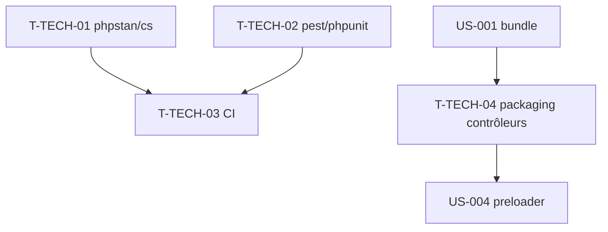

# Tâches techniques transverses — Sprint 001

> Outillage qualité/CI, prérequis au développement TDD. À faire **en début de sprint** (avant/pendant US-001).

| ID | Type | Tâche | Est. | Dépend de | Statut |
|----|------|-------|------|-----------|--------|
| T-TECH-01 | [OPS] | Config PHPStan (niveau max) + php-cs-fixer (PSR-12) | 2h | — | 🔲 |
| T-TECH-02 | [OPS] | Config Pest 4 / PHPUnit 12 (bootstrap bundle + démo) | 2h | T-001-01 | 🔲 |
| T-TECH-03 | [OPS] | CI GitHub Actions minimale (install, phpstan, tests, tailwind:build) | 3h | T-TECH-01, T-TECH-02 | 🔲 |
| T-TECH-04 | [OPS] | Packaging assets/contrôleurs du bundle (`package.json` `symfony.controllers` + assets bundle → AssetMapper) | 2h | T-001-02 | 🔲 |

**Total : 9h**

---

## Détail

### T-TECH-01 · [OPS] PHPStan max + php-cs-fixer — 2h
**Fichiers** : `phpstan.neon`, `.php-cs-fixer.dist.php`
**Critères** :
- [ ] PHPStan **niveau max** configuré sur `src/`.
- [ ] Règles PSR-12 (php-cs-fixer), commande `make cs` / composer script.
- [ ] `phpstan analyse` passe sur un `src/` vide (baseline propre).

### T-TECH-02 · [OPS] Pest / PHPUnit — 2h
**Fichiers** : `phpunit.dist.xml`, `tests/bootstrap.php`, `demo/phpunit.dist.xml`
**Critères** :
- [ ] Suites configurées (Unit, Functional) côté bundle et démo.
- [ ] Couverture activée (objectif ≥ 80 % du code PHP).
- [ ] `vendor/bin/pest` / `phpunit` s'exécute (0 test → vert).

### T-TECH-03 · [OPS] CI minimale — 3h
**Fichiers** : `.github/workflows/ci.yml`
**Critères** :
- [ ] Jobs : `composer install`, `phpstan`, `tests`, `tailwind:build` (vérifie la chaîne CSS).
- [ ] Échec bloquant si PHPStan ou tests échouent.
- [ ] Cache Composer pour accélérer.

> La CI **complète** (lint front, axe-core, scan CVE, couverture stricte) est portée par **US-026** (EPIC-007). Ici, on pose le socle minimal pour sécuriser le Sprint 1.

### T-TECH-04 · [OPS] Packaging des contrôleurs du bundle — 2h
**Fichiers** : `package.json` (racine bundle), `config/services.yaml` (asset path), `assets/controllers/`
**Contexte** : remonté de US-005 (déplacée en Sprint 2) car le contrôleur `preloader` de **US-004** en a besoin dès le Sprint 1 (ADR-003).
**Critères** :
- [ ] `package.json` avec clé `symfony.controllers` (mécanisme d'auto-enregistrement Flex/StimulusBundle).
- [ ] Les assets du bundle (`assets/`) sont exposés à l'AssetMapper de la démo.
- [ ] Un contrôleur de test (ou `preloader`) s'auto-enregistre et s'exécute dans la démo (`data-controller="tailsfadmin--…"`).

## Graphe de dépendances

