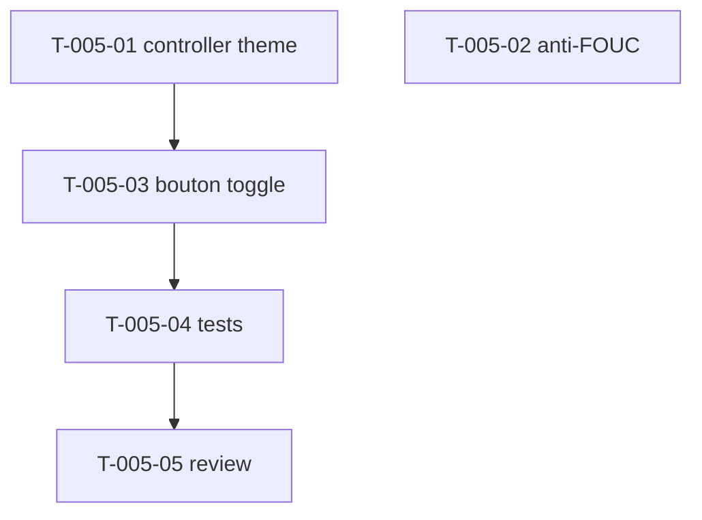

# Tâches — US-005 : Bascule clair/dark persistante (Stimulus)

## Informations US
- **Epic** : EPIC-002-layout-navigation · **Persona** : P-002, P-004 · **Points** : 5 · **Sprint** : sprint-002

## Résumé
**En tant que** designer / utilisateur **je veux** une bascule clair/sombre persistante **afin de** conserver ma préférence entre les rechargements.

> Conversion Alpine → Stimulus du `theme-toggle` (ADR-004). Le **packaging des contrôleurs existe déjà** (T-TECH-04, Sprint 1) → on ajoute `theme` au `package.json` `symfony.controllers`. Tokens `.dark` déjà définis (US-002). Bouton déjà réservé dans le header (US-004).

## Vue d'ensemble des tâches

| ID | Type | Tâche | Est. | Dépend de | Statut |
|----|------|-------|------|-----------|--------|
| T-005-01 | [FE-WEB] | Contrôleur Stimulus `theme` + déclaration `symfony.controllers` | 3h | — | 🔲 |
| T-005-02 | [FE-WEB] | Script inline anti-FOUC (<200 o) dans le layout | 1h | — | 🔲 |
| T-005-03 | [FE-WEB] | Bouton toggle (SVG soleil/lune) câblé dans le header | 2h | T-005-01 | 🔲 |
| T-005-04 | [TEST] | Tests : toggle `.dark`, persistance, dégradation localStorage | 3h | T-005-03 | 🔲 |
| T-005-05 | [REV] | Code review US-005 | 1h | T-005-04 | 🔲 |

**Total : 10h**

---

## Détail

### T-005-01 · [FE-WEB] Contrôleur Stimulus `theme` — 3h
**Source** : `Tools/sources/tailadmin-laravel-main/resources/views/components/common/theme-toggle.blade.php`
**Fichiers** : `assets/controllers/theme_controller.js`, `assets/package.json` (+ entrée `symfony.controllers`)
**Critères** :
- [ ] Lit `localStorage.theme` à l'init ; applique/retire `.dark` sur `<html>`.
- [ ] Action `toggle()` : bascule + persiste (`dark`/`light`).
- [ ] Fallback `prefers-color-scheme` si aucune préférence stockée.
- [ ] `try/catch` autour de `localStorage` (dégradation gracieuse).
- [ ] Déclaré dans `package.json` → auto-enregistré `data-controller="tailsfadmin--theme"`.

### T-005-02 · [FE-WEB] Script anti-FOUC — 1h
**Fichiers** : `templates/layout/admin.html.twig` (`<head>`)
**Critères** :
- [ ] Script inline **< 200 o**, bloquant, applique `.dark` **avant le premier paint**.
- [ ] Indépendant de Stimulus ; aucun flash clair au rechargement en mode sombre.

### T-005-03 · [FE-WEB] Bouton toggle — 2h
**Source** : SVG soleil/lune de `src/partials/header.html`
**Fichiers** : composant `tsf:Layout:Header` (emplacement déjà réservé US-004)
**Critères** :
- [ ] Bouton `data-controller`/`data-action` → `theme#toggle`, `aria-label` explicite, reflète l'état.

### T-005-04 · [TEST] Tests — 3h
**Critères** :
- [ ] Toggle ajoute puis retire `.dark` ; `localStorage.theme` = `dark`/`light`.
- [ ] `localStorage` bloqué → thème clair par défaut, **aucune exception JS**.
- [ ] Contrôleur absent → avertissement Stimulus (scénario erreur US-005).
- [ ] (Si outil navigateur dispo) FOUC non perceptible au reload.

### T-005-05 · [REV] Code review — 1h

## Graphe de dépendances

