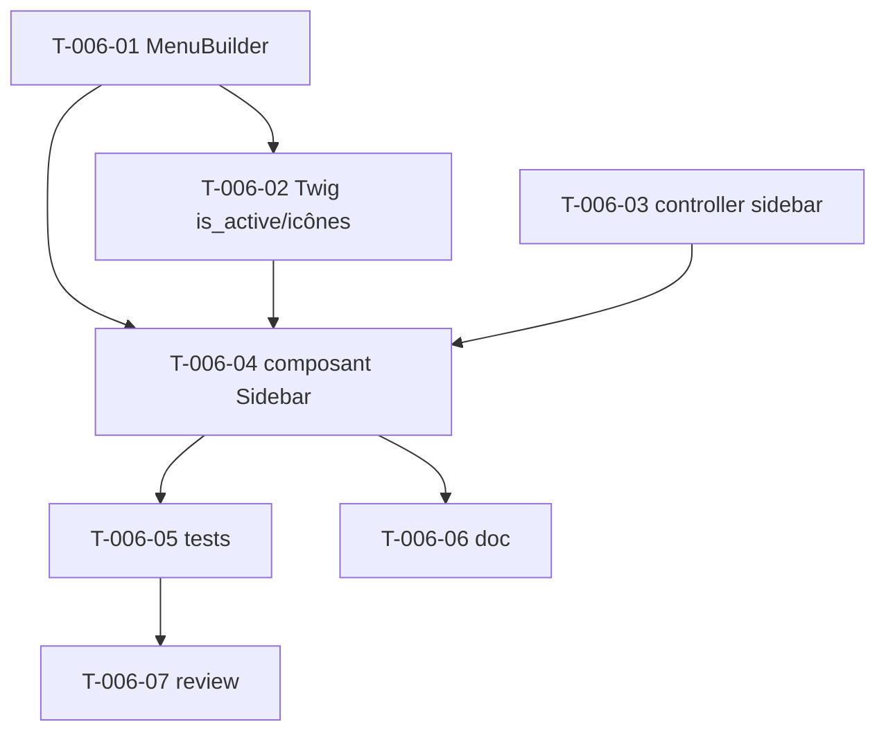

# Tâches — US-006 : Sidebar responsive multi-niveaux

## Informations US
- **Epic** : EPIC-002-layout-navigation · **Persona** : P-004 · **Points** : 8 · **Sprint** : sprint-002

## Résumé
**En tant que** utilisateur admin **je veux** une sidebar multi-niveaux, repliable (desktop) et en drawer (mobile), avec l'item actif surligné **afin de** naviguer efficacement quel que soit l'écran.

> Rend interactive la sidebar **statique** d'US-004. Conversion Alpine → Stimulus (ADR-004). Menu piloté par un service **`MenuBuilder`** (configurable, calqué sur `MenuHelper` Laravel). Classes `ltr:`/`rtl:` posées dès maintenant (préparation RTL, ADR-005).

## Vue d'ensemble des tâches

| ID | Type | Tâche | Est. | Dépend de | Statut |
|----|------|-------|------|-----------|--------|
| T-006-01 | [BE] | Service `MenuBuilder` (arborescence configurable) + Configuration DI | 4h | — | 🔲 |
| T-006-02 | [BE] | Twig Extension `is_active()` + rendu icônes SVG | 2h | T-006-01 | 🔲 |
| T-006-03 | [FE-WEB] | Contrôleur Stimulus `sidebar` (collapse desktop persistant, drawer mobile + overlay, focus trap, Échap) | 5h | — | 🔲 |
| T-006-04 | [FE-WEB] | Composant `tsf:Layout:Sidebar` multi-niveaux (sous-menus, item actif, ltr:/rtl:) | 4h | T-006-01, T-006-02, T-006-03 | 🔲 |
| T-006-05 | [TEST] | Tests (MenuBuilder unit, item actif, états DOM sidebar, drawer) | 3h | T-006-04 | 🔲 |
| T-006-06 | [DOC] | Documenter la configuration du MenuBuilder | 1h | T-006-04 | 🔲 |
| T-006-07 | [REV] | Code review US-006 | 1h | T-006-05 | 🔲 |

**Total : 20h**

---

## Détail

### T-006-01 · [BE] Service `MenuBuilder` — 4h
**Source** : `Tools/sources/tailadmin-laravel-main/app/Helpers/MenuHelper.php` (`getMenuGroups()`)
**Fichiers** : `src/Menu/MenuBuilder.php`, `src/Menu/MenuItem.php`, `src/DependencyInjection/Configuration.php` (+ extension `prepend`/config)
**Critères** :
- [ ] Arborescence de menu (groupes MENU/OTHERS, items, sous-items) **configurable** via `config/packages/tailsfadmin.yaml`.
- [ ] Valeurs par défaut calquées sur `MenuHelper` (Dashboard, Calendar, Profile, Forms, Tables, Pages, Charts, UI Elements, Authentication).
- [ ] Testable (retourne une structure typée).

### T-006-02 · [BE] Twig Extension `is_active` + icônes — 2h
**Fichiers** : `src/Twig/TailsfadminExtension.php` (functions)
**Critères** :
- [ ] `is_active(path)` : surlignage via la route courante (équivalent `request()->is()`).
- [ ] `tsf_icon(name)` : rendu SVG inline par clé (dashboard, calendar, …), source `sidebar.html`.
- [ ] PHPStan max OK.

### T-006-03 · [FE-WEB] Contrôleur Stimulus `sidebar` — 5h
**Source** : Alpine dans `src/partials/sidebar.html` + `overlay.html`
**Fichiers** : `assets/controllers/sidebar_controller.js` (+ `package.json`)
**Critères** :
- [ ] Desktop : collapse/expand (mode icônes), état **persisté en localStorage**, pas d'animation au chargement.
- [ ] Mobile : drawer ouvert/fermé, overlay, **focus trap**, fermeture Échap + clic overlay, retour focus au hamburger.
- [ ] `targets` : sidebar, overlay, toggle, submenu ; ARIA cohérents.

### T-006-04 · [FE-WEB] Composant Sidebar multi-niveaux — 4h
**Fichiers** : composant `tsf:Layout:Sidebar` (refonte de la version statique US-004)
**Critères** :
- [ ] Rendu depuis `MenuBuilder` (groupes/items/sous-items), sous-menus dépliables.
- [ ] Item actif surligné via `is_active()`.
- [ ] Classes `ltr:`/`rtl:` sur marges/positions (préparation RTL).
- [ ] Dark mode cohérent.

### T-006-05 · [TEST] Tests — 3h
**Fichiers** : `tests/Unit/Menu/MenuBuilderTest.php`, `demo/tests/Functional/SidebarTest.php`
**Critères** :
- [ ] `MenuBuilder` : structure attendue, item actif résolu.
- [ ] Rendu : sections MENU/OTHERS, items, sous-menu, classe active présente.
- [ ] Aucune exception si route inconnue (scénario erreur US-006).

### T-006-06 · [DOC] Doc MenuBuilder — 1h
**Critères** : exemple de `config/packages/tailsfadmin.yaml` pour personnaliser le menu.

### T-006-07 · [REV] Code review — 1h

## Graphe de dépendances

