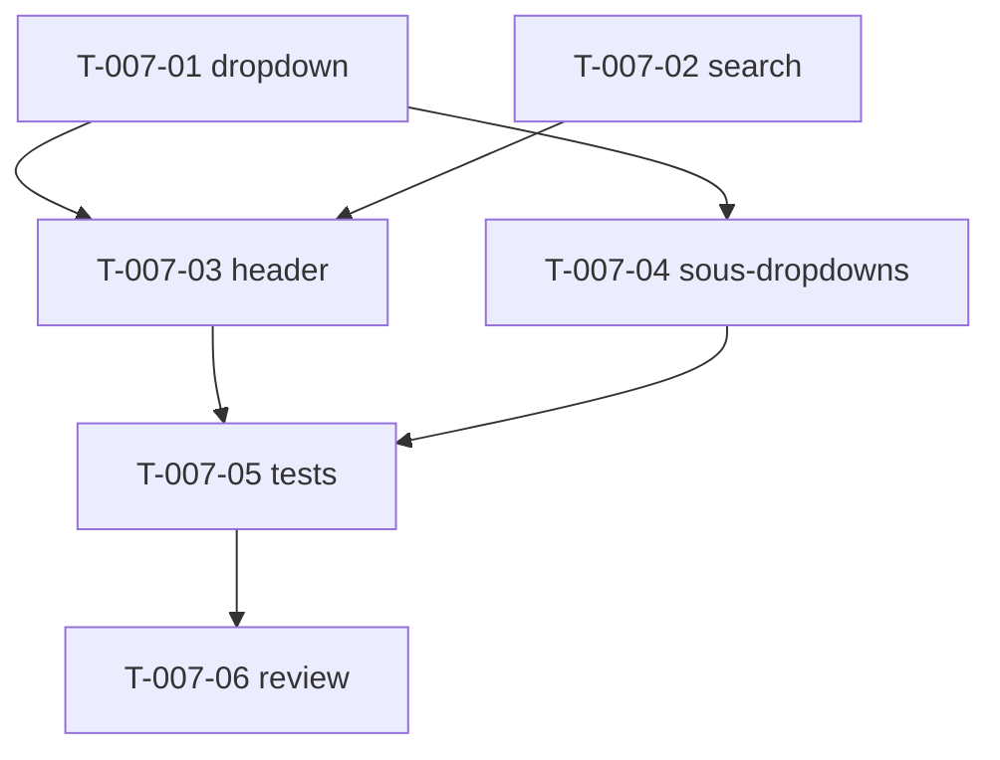

# Tâches — US-007 : Header (recherche Cmd/Ctrl+K, dropdowns, breadcrumb)

## Informations US
- **Epic** : EPIC-002-layout-navigation · **Persona** : P-004 · **Points** : 8 · **Sprint** : sprint-002

## Résumé
**En tant que** utilisateur admin **je veux** un header avec recherche rapide au clavier (Cmd/Ctrl+K et « / »), dropdown profil et dropdown notifications **afin d'**accéder vite aux fonctions transversales sans quitter la page.

> Conversion Alpine → Stimulus (ADR-004). Contrôleur `dropdown` **générique et réutilisable** (user-menu, notifications, et actions de tables futures). Recherche = coquille visuelle (pas de backend), mais focus + raccourcis fonctionnels. Avatar/compteurs via variables Twig configurables.

## Vue d'ensemble des tâches

| ID | Type | Tâche | Est. | Dépend de | Statut |
|----|------|-------|------|-----------|--------|
| T-007-01 | [FE-WEB] | Contrôleur Stimulus `dropdown` générique (clavier, Échap, clickOutside, ARIA) | 5h | — | 🔲 |
| T-007-02 | [FE-WEB] | Contrôleur Stimulus `search` (raccourcis Cmd/Ctrl+K et « / », focus, ignore si input focus) | 4h | — | 🔲 |
| T-007-03 | [FE-WEB] | Refonte composant `tsf:Layout:Header` (recherche, user-menu, notifications, breadcrumb) | 3h | T-007-01, T-007-02 | 🔲 |
| T-007-04 | [FE-WEB] | Sous-composants dropdown user-menu + notifications (avatar/compteurs via Twig) | 2h | T-007-01 | 🔲 |
| T-007-05 | [TEST] | Tests (raccourcis clavier, ARIA aria-expanded, clickOutside, ignore si input) | 3h | T-007-03, T-007-04 | 🔲 |
| T-007-06 | [REV] | Code review US-007 | 1h | T-007-05 | 🔲 |

**Total : 18h**

---

## Détail

### T-007-01 · [FE-WEB] Contrôleur `dropdown` générique — 5h
**Source** : dropdowns Alpine du header + `components/common/dropdown-menu.blade.php`
**Fichiers** : `assets/controllers/dropdown_controller.js` (+ `package.json`)
**Critères** :
- [ ] Ouverture/fermeture au clic ; `aria-expanded` synchronisé.
- [ ] `role="menu"` / `role="menuitem"` ; navigation **flèches haut/bas**, `Home`/`End`.
- [ ] Fermeture **Échap** (focus retourne au déclencheur) et **clic extérieur** (`clickOutside`).
- [ ] Plusieurs dropdowns indépendants (un clic n'affecte pas les autres).

### T-007-02 · [FE-WEB] Contrôleur `search` — 4h
**Source** : `src/js/index.js` (raccourcis `Cmd/Ctrl+K` et `/`)
**Fichiers** : `assets/controllers/search_controller.js` (+ `package.json`)
**Critères** :
- [ ] `Cmd/Ctrl+K` et `/` ouvrent la recherche et lui donnent le focus.
- [ ] `/` n'est pas inséré dans le champ ; raccourci **ignoré si un champ de formulaire a le focus**.
- [ ] `Échap` ferme et rend le focus au déclencheur.
- [ ] Coquille visuelle (pas de backend de recherche).

### T-007-03 · [FE-WEB] Refonte Header — 3h
**Source** : `src/partials/header.html`
**Critères** :
- [ ] Barre de recherche (câblée `search`), dropdown user (`dropdown`), dropdown notifications (`dropdown`), breadcrumb (composant US-004).
- [ ] Bouton hamburger relié à la sidebar (US-006) ; bouton theme-toggle (US-005).
- [ ] Dark mode + responsive fidèles.

### T-007-04 · [FE-WEB] Sous-composants dropdowns — 2h
**Source** : `components/header/{user-dropdown,notification-dropdown}`
**Critères** :
- [ ] Contenus user (Profil, Paramètres, Déconnexion) et notifications.
- [ ] Avatar et compteurs injectés via **variables Twig configurables** dans la démo.

### T-007-05 · [TEST] Tests — 3h
**Critères** :
- [ ] Ouverture recherche via Ctrl+K ; ignorée si focus dans un `input[type=text]` (scénario erreur US-007).
- [ ] Dropdown : `aria-expanded` true/false, fermeture clic extérieur, indépendance des dropdowns.
- [ ] (Si outil navigateur dispo) navigation clavier flèches.

### T-007-06 · [REV] Code review — 1h

## Graphe de dépendances

