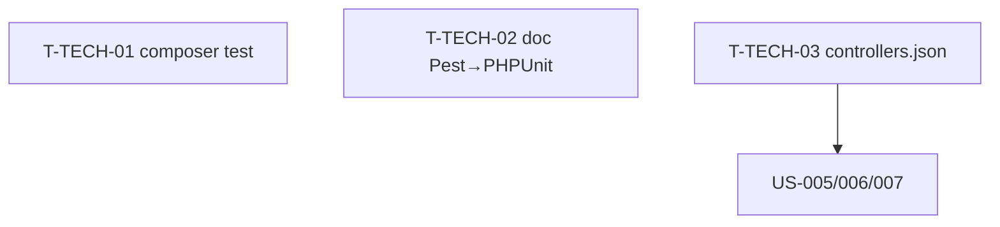

# Tâches techniques transverses — Sprint 002

> Intègre les **actions de la rétro Sprint 1**. À faire en début de sprint.

| ID | Type | Tâche | Est. | Dépend de | Statut |
|----|------|-------|------|-----------|--------|
| T-TECH-01 | [OPS] | Script `composer test` (build → compile → phpunit) dans la démo | 1h | — | 🔲 |
| T-TECH-02 | [DOC] | Corriger la doc stack « Pest 4 / PHPUnit 12 » → PHPUnit 12 | 0.5h | — | 🔲 |
| T-TECH-03 | [OPS] | Déclarer les nouveaux contrôleurs (`theme`, `sidebar`, `dropdown`, `search`) dans `controllers.json` de la démo | 1h | — | 🔲 |

**Total : 2.5h**

---

## Détail

### T-TECH-01 · [OPS] Script `composer test` — 1h (action rétro #1)
**Fichiers** : `demo/composer.json` (scripts)
**Contexte** : footgun Sprint 1 — `tailwind:build` sans `asset-map:compile` désynchronise `public/assets` (404 CSS transitoire).
**Critères** :
- [ ] `composer test` (démo) enchaîne `tailwind:build` → `asset-map:compile` → `phpunit`.
- [ ] Vert et reproductible depuis un checkout propre.
- [ ] La CI (`.github/workflows/ci.yml`) peut l'utiliser ou conserver son ordre explicite.

### T-TECH-02 · [DOC] Corriger la contradiction Pest/PHPUnit — 0.5h (action rétro #2)
**Fichiers** : `.claude/CLAUDE.md` (ou doc projet), `prd.md` si mentionné
**Critères** :
- [ ] Remplacer « Pest 4 / PHPUnit 12 » par **PHPUnit 12** (Pest 4 incompatible avec PHPUnit 12).
- [ ] Cohérence de la doc de stack.

### T-TECH-03 · [OPS] Enregistrement des contrôleurs — 1h
**Fichiers** : `demo/assets/controllers.json`, `assets/package.json` (bundle)
**Critères** :
- [ ] Les 4 nouveaux contrôleurs Stimulus du bundle sont déclarés et auto-enregistrés dans la démo.
- [ ] `asset-map:compile` OK ; `data-controller="tailsfadmin--<name>"` présents.

> Action rétro #3 (doc du caveat `asset_mapper.yaml`) reste rattachée à **US-026** (EPIC-007), plus tard.

## Graphe

