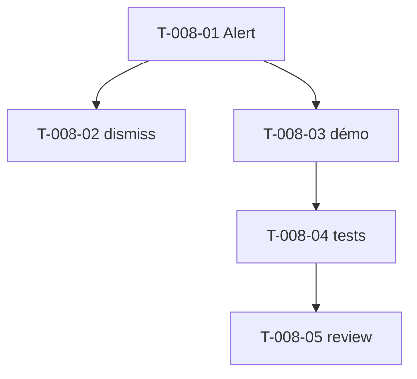

# Tâches — US-008 : Composants Alerts (4 variantes)

## Informations US
- **Epic** : EPIC-003-composants-ui · **Persona** : P-001, P-002 · **Points** : 3 · **Sprint** : sprint-003

## Résumé
**En tant que** développeur / designer **je veux** un composant Alert (success, info, warning, error) **afin de** signaler des messages de façon cohérente et accessible.

> Source : `Tools/sources/tailadmin-free-tailwind-dashboard-template-main/src/partials/alert/alert-{success,info,warning,error}.html` + Laravel `components/ui/alert*`. Composant `tsf:Ui:Alert`. Fermeture optionnelle → micro-contrôleur Stimulus `alert-dismiss`.

## Vue d'ensemble des tâches

| ID | Type | Tâche | Est. | Dépend de | Statut |
|----|------|-------|------|-----------|--------|
| T-008-01 | [FE-WEB] | Composant `tsf:Ui:Alert` (prop `type` → 4 variantes, `title`, `message`, `dismissible`) | 3h | — | 🔲 |
| T-008-02 | [FE-WEB] | Contrôleur Stimulus `alert-dismiss` (fermeture) + déclaration | 1h | T-008-01 | 🔲 |
| T-008-03 | [FE-WEB] | Page démo galerie alertes (les 4 variantes) | 1h | T-008-01 | 🔲 |
| T-008-04 | [TEST] | Tests (rendu 4 variantes, couleurs/icônes, dismissible câblé) | 2h | T-008-03 | 🔲 |
| T-008-05 | [REV] | Code review | 0.5h | T-008-04 | 🔲 |

**Total : 7.5h**

---

## Détail

### T-008-01 · [FE-WEB] Composant Alert — 3h
**Fichiers** : `src/Twig/Components/Ui/Alert.php` + `templates/components/Ui/Alert.html.twig`
**Critères** :
- [ ] Prop `type` ∈ {success, info, warning, error} → couleurs/icône SVG correspondantes (fidèle source).
- [ ] Props `title`, `message` (slot possible), `dismissible` (bool).
- [ ] Accessibilité : `role="alert"`, contraste WCAG AA (clair + dark).
- [ ] Échappement Twig (pas de `|raw` sur entrée).

### T-008-02 · [FE-WEB] Contrôleur `alert-dismiss` — 1h
**Fichiers** : `assets/controllers/alert-dismiss_controller.js` (+ `package.json`, `demo/assets/controllers.json`)
**Critères** :
- [ ] Bouton de fermeture retire l'alerte du DOM ; `aria-label` explicite.
- [ ] Présent uniquement si `dismissible`.

### T-008-03 · [FE-WEB] Démo — 1h
**Critères** : page/section démo affichant les 4 variantes (+ une dismissible), clair et dark.

### T-008-04 · [TEST] Tests — 2h
**Fichiers** : `demo/tests/Functional/AlertTest.php`
**Critères** :
- [ ] Les 4 variantes rendent la bonne classe/couleur.
- [ ] `dismissible` → bouton + `data-controller="tailsfadmin--alert-dismiss"`.
- [ ] `role="alert"` présent.

### T-008-05 · [REV] Review — 0.5h

## Graphe

