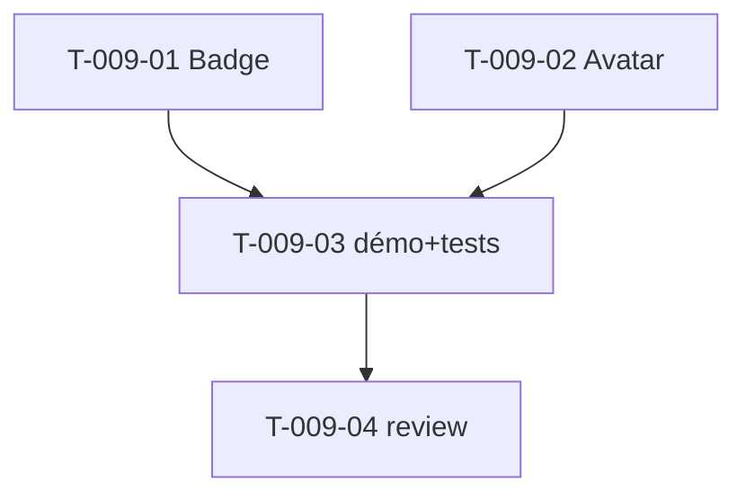

# Tâches — US-009 : Composants Badges & Avatars

## Informations US
- **Epic** : EPIC-003-composants-ui · **Persona** : P-001, P-002 · **Points** : 3 · **Sprint** : sprint-003

## Résumé
**En tant que** développeur / designer **je veux** des composants Badge (6 variantes) et Avatar (4 tailles + statut) **afin de** afficher statuts et identités de façon cohérente.

> Sources : `src/partials/badge/badge-01..06.html`, `src/partials/avatar/avatar-01..04.html`. Composants `tsf:Ui:Badge`, `tsf:Ui:Avatar` (présentational).

## Vue d'ensemble des tâches

| ID | Type | Tâche | Est. | Dépend de | Statut |
|----|------|-------|------|-----------|--------|
| T-009-01 | [FE-WEB] | Composant `tsf:Ui:Badge` (prop couleur/variante + taille, 6 variantes) | 2h | — | 🔲 |
| T-009-02 | [FE-WEB] | Composant `tsf:Ui:Avatar` (prop taille 4 niveaux + statut en ligne + fallback initiales) | 2h | — | 🔲 |
| T-009-03 | [TEST] | Démo galerie + tests (variantes badge, tailles/statut avatar) | 2h | T-009-01, T-009-02 | 🔲 |
| T-009-04 | [REV] | Code review | 0.5h | T-009-03 | 🔲 |

**Total : 6.5h**

---

## Détail

### T-009-01 · [FE-WEB] Badge — 2h
**Fichiers** : `src/Twig/Components/Ui/Badge.php` + template
**Critères** :
- [ ] Props `color`/`variant` (6 variantes fidèles source), `size`.
- [ ] Slot de contenu ; dark mode cohérent, contraste AA.

### T-009-02 · [FE-WEB] Avatar — 2h
**Fichiers** : `src/Twig/Components/Ui/Avatar.php` + template
**Critères** :
- [ ] Props `size` (4 tailles), `src`/`alt`, `status` (en ligne/hors ligne → pastille).
- [ ] Fallback initiales si pas d'image ; `alt` obligatoire.

### T-009-03 · [TEST] Démo + tests — 2h
**Fichiers** : `demo/tests/Functional/BadgeAvatarTest.php`
**Critères** :
- [ ] 6 variantes badge rendues ; 4 tailles avatar + pastille de statut.
- [ ] `alt` présent sur l'avatar image.

### T-009-04 · [REV] Review — 0.5h

## Graphe

