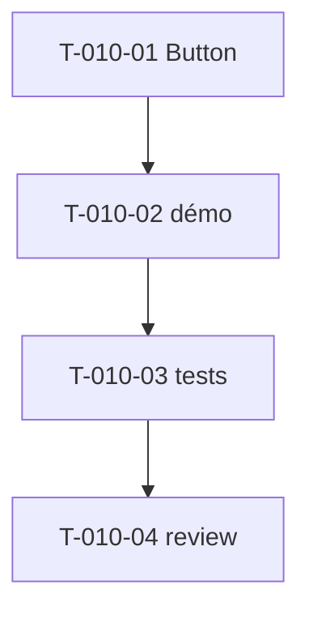

# Tâches — US-010 : Composants Buttons (6 variantes)

## Informations US
- **Epic** : EPIC-003-composants-ui · **Persona** : P-001, P-002 · **Points** : 3 · **Sprint** : sprint-003

## Résumé
**En tant que** développeur / designer **je veux** un composant Button (variantes, tailles, icônes, états) **afin de** garantir des actions cohérentes et accessibles.

> Source : `src/partials/buttons/button-01..06.html`. Composant `tsf:Ui:Button`.

## Vue d'ensemble des tâches

| ID | Type | Tâche | Est. | Dépend de | Statut |
|----|------|-------|------|-----------|--------|
| T-010-01 | [FE-WEB] | Composant `tsf:Ui:Button` (variantes primaire/secondaire/outline…, tailles, icône G/D, disabled, loading) | 3h | — | 🔲 |
| T-010-02 | [FE-WEB] | Page démo galerie boutons | 1h | T-010-01 | 🔲 |
| T-010-03 | [TEST] | Tests (variantes, tailles, disabled/loading, rendu `<button>`/`<a>`) | 2h | T-010-02 | 🔲 |
| T-010-04 | [REV] | Code review | 0.5h | T-010-03 | 🔲 |

**Total : 6.5h**

---

## Détail

### T-010-01 · [FE-WEB] Button — 3h
**Fichiers** : `src/Twig/Components/Ui/Button.php` + template
**Critères** :
- [ ] Props : `variant` (6 fidèles source), `size`, `iconStart`/`iconEnd`, `disabled`, `loading`, `href` (rend `<a>` si présent, sinon `<button>`).
- [ ] `loading` → spinner + `aria-busy` ; `disabled` → attribut + style.
- [ ] Focus visible, contraste AA, dark mode.

### T-010-02 · [FE-WEB] Démo — 1h
**Critères** : galerie des variantes/tailles/états.

### T-010-03 · [TEST] Tests — 2h
**Fichiers** : `demo/tests/Functional/ButtonTest.php`
**Critères** :
- [ ] Variantes/tailles rendues ; `disabled`/`loading` (`aria-busy`) ; `<a>` si `href`.

### T-010-04 · [REV] Review — 0.5h

## Graphe

