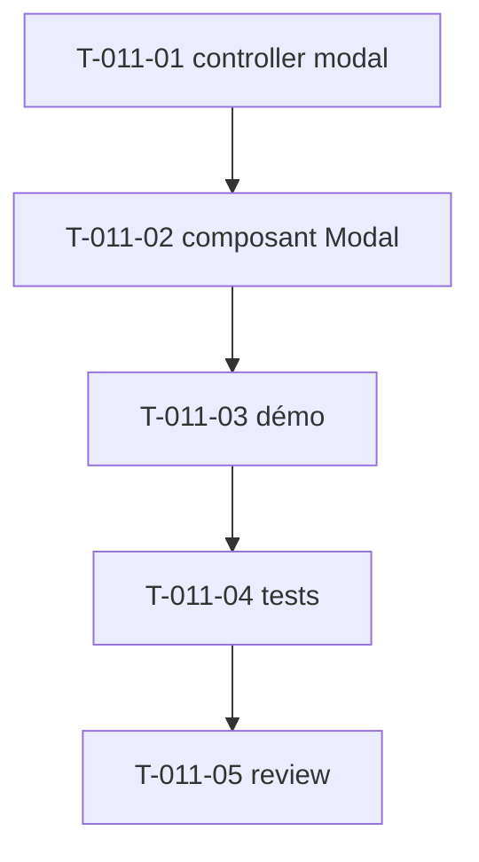

# Tâches — US-011 : Modals / overlays accessibles (Stimulus)

## Informations US
- **Epic** : EPIC-003-composants-ui · **Persona** : P-002, P-004 · **Points** : 5 · **Sprint** : sprint-003

## Résumé
**En tant que** designer / utilisateur **je veux** des modales accessibles (focus trap, Échap, clic overlay) **afin de** présenter des contenus/actions sans quitter la page, sans piéger l'utilisateur.

> Source : `src/partials/overlay.html`, modales profil/calendrier. Nouveau contrôleur `modal`. Réutilise le pattern focus trap éprouvé sur la sidebar drawer (US-006). C'est la brique bloquant US-020 (calendrier) et US-022 (profil).

## Vue d'ensemble des tâches

| ID | Type | Tâche | Est. | Dépend de | Statut |
|----|------|-------|------|-----------|--------|
| T-011-01 | [FE-WEB] | Contrôleur Stimulus `modal` (open/close, focus trap, Échap, clic overlay, restitution focus, `aria-modal`) | 4h | — | 🔲 |
| T-011-02 | [FE-WEB] | Composant `tsf:Ui:Modal` + overlay (slots header/body/footer, tailles) | 3h | T-011-01 | 🔲 |
| T-011-03 | [FE-WEB] | Démo (bouton déclencheur → modale) | 1h | T-011-02 | 🔲 |
| T-011-04 | [TEST] | Tests (rendu, `role="dialog"`/`aria-modal`, câblage open/close, target overlay) | 2h | T-011-03 | 🔲 |
| T-011-05 | [REV] | Code review | 1h | T-011-04 | 🔲 |

**Total : 11h**

---

## Détail

### T-011-01 · [FE-WEB] Contrôleur `modal` — 4h
**Fichiers** : `assets/controllers/modal_controller.js` (+ `package.json`, `demo/assets/controllers.json`)
**Critères** :
- [ ] `open()`/`close()` ; **focus trap** (Tab/Shift+Tab cyclique) ; fermeture **Échap** + **clic overlay**.
- [ ] **Restitution du focus** à l'élément déclencheur à la fermeture.
- [ ] `aria-modal="true"`, `role="dialog"`, `aria-labelledby` ; scroll body verrouillé pendant l'ouverture.

### T-011-02 · [FE-WEB] Composant Modal — 3h
**Fichiers** : `src/Twig/Components/Ui/Modal.php` + template
**Critères** :
- [ ] Slots `header`/`body`/`footer` ; prop `size` ; overlay ; bouton fermeture.
- [ ] Câblé au contrôleur `modal` (targets/actions) ; dark mode.

### T-011-03 · [FE-WEB] Démo — 1h
**Critères** : un bouton ouvre la modale ; fermeture par les 3 voies.

### T-011-04 · [TEST] Tests — 2h
**Fichiers** : `demo/tests/Functional/ModalTest.php`
**Critères** :
- [ ] `role="dialog"`, `aria-modal`, target overlay présents ; bouton déclencheur câblé.
- [ ] (Comportement clavier réel : couvert par le spike Panther T-TECH-02.)

### T-011-05 · [REV] Review — 1h

## Graphe

