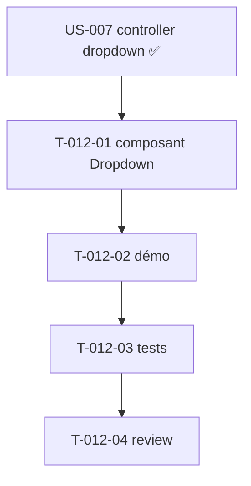

# Tâches — US-012 : Dropdowns accessibles (Twig sur contrôleur existant)

## Informations US
- **Epic** : EPIC-003-composants-ui · **Persona** : P-001, P-004 · **Points** : 5 · **Sprint** : sprint-003

## Résumé
**En tant que** développeur / utilisateur **je veux** un composant Dropdown accessible et réutilisable **afin de** proposer des menus contextuels cohérents (clavier, ARIA, fermeture).

> **Allégée** : le contrôleur Stimulus `dropdown` générique **existe déjà** (US-007 : clavier flèches/Home/End, Échap, clickOutside, `aria-expanded`, `role=menu`). Cette US en fait un **Twig Component** `tsf:Ui:Dropdown` réutilisable (au-delà du header) + variantes. Sources : `components/common/dropdown-menu.blade.php`, `table-dropdown.blade.php`.

## Vue d'ensemble des tâches

| ID | Type | Tâche | Est. | Dépend de | Statut |
|----|------|-------|------|-----------|--------|
| T-012-01 | [FE-WEB] | Composant `tsf:Ui:Dropdown` (slots `trigger`/`menu`, items, alignement) câblé au contrôleur existant | 3h | — | 🔲 |
| T-012-02 | [FE-WEB] | Page démo galerie dropdowns (menu simple + menu d'actions) | 1h | T-012-01 | 🔲 |
| T-012-03 | [TEST] | Tests (structure `role=menu`/`menuitem`, `aria-expanded`, `data-controller`) | 2h | T-012-02 | 🔲 |
| T-012-04 | [REV] | Code review | 0.5h | T-012-03 | 🔲 |

**Total : 6.5h**

---

## Détail

### T-012-01 · [FE-WEB] Composant Dropdown — 3h
**Fichiers** : `src/Twig/Components/Ui/Dropdown.php` + template
**Critères** :
- [ ] Slots `trigger` et `menu` (liste d'items `role="menuitem"`) ; prop `align` (left/right).
- [ ] Câblé au contrôleur **existant** `tailsfadmin--dropdown` (targets `trigger`/`menu`, `aria-expanded`).
- [ ] Réutilisable hors header ; dark mode ; DRY (pas de duplication du header).

### T-012-02 · [FE-WEB] Démo — 1h
**Critères** : un menu simple + un menu d'actions (style table-dropdown).

### T-012-03 · [TEST] Tests — 2h
**Fichiers** : `demo/tests/Functional/DropdownComponentTest.php`
**Critères** :
- [ ] `role="menu"`/`menuitem`, `aria-expanded`, `data-controller="tailsfadmin--dropdown"` présents.
- [ ] (Navigation clavier réelle : couverte par le spike Panther T-TECH-02.)

### T-012-04 · [REV] Review — 0.5h

## Graphe

