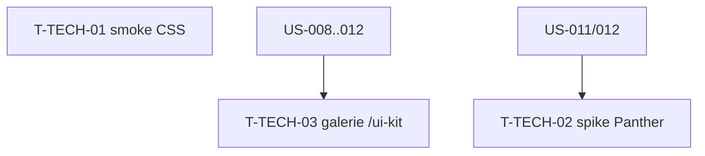

# Tâches techniques transverses — Sprint 003

> Garde-fous issus de l'incident CSS (Sprint 2) + page galerie. À intégrer tôt.

| ID | Type | Tâche | Est. | Dépend de | Statut |
|----|------|-------|------|-----------|--------|
| T-TECH-01 | [TEST] | Smoke-test du CSS compilé (présence classes composant + utilitaires structurels) | 1.5h | — | 🔲 |
| T-TECH-02 | [OPS] | Spike `symfony/panther` : 1er test navigateur (comportement JS réel) | 3h | US-011 ou US-012 | 🔲 |
| T-TECH-03 | [FE-WEB] | Page démo « galerie UI Kit » (`/ui-kit`) agrégeant les composants | 2h | US-008..012 | 🔲 |

**Total : 6.5h**

---

## Détail

### T-TECH-01 · [TEST] Smoke-test CSS compilé — 1.5h (garde-fou #1)
**Contexte** : au Sprint 2, le layout s'affichait non stylé sans qu'aucun test ne l'attrape (les tests vérifiaient le DOM, pas le CSS calculé/compilé).
**Fichiers** : `demo/tests/Functional/CssBuildTest.php`
**Critères** :
- [ ] Après build/compile, le CSS compilé (`public/assets/styles/app-*.css`) **contient** des classes composant (`.menu-item`) ET des utilitaires structurels (`flex`, `fixed`).
- [ ] Le test échoue si l'une manque (attrape une régression de port CSS / `@source`).
- [ ] Intégré à `composer test` et à la CI.

### T-TECH-02 · [OPS] Spike Panther — 3h (garde-fou #2)
**Fichiers** : `demo/composer.json` (require-dev `symfony/panther`), `demo/tests/E2E/…`
**Critères** :
- [ ] `symfony/panther` installé ; 1 test navigateur vert prouvant un **comportement JS réel** (ex. ouverture/fermeture de modale, ou toggle dark → classe `.dark` réellement appliquée).
- [ ] Documenté (comment lancer ; exclu de `composer test` si trop lourd, job CI dédié optionnel).

### T-TECH-03 · [FE-WEB] Galerie UI Kit — 2h
**Fichiers** : `demo/src/Controller/UiKitController.php`, `demo/templates/ui-kit/*`
**Critères** :
- [ ] Route `/ui-kit` présentant alerts, badges, avatars, buttons, dropdowns, modal (clair + dark).
- [ ] Sert de vitrine et de support de revue visuelle (Sprint Review).

## Graphe

