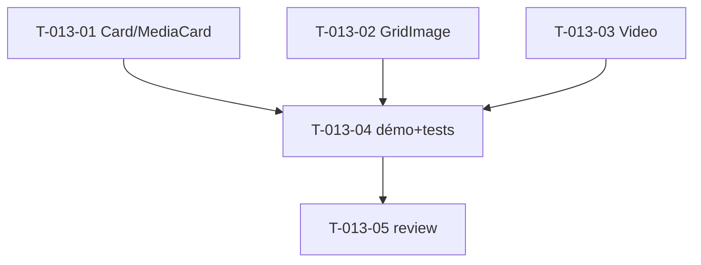

# Tâches — US-013 : Cards, media cards, grid images, videos

## Informations US
- **Epic** : EPIC-003-composants-ui · **Persona** : P-001, P-002, P-004 · **Points** : 5 · **Sprint** : sprint-004

## Résumé
**En tant que** développeur / designer **je veux** des composants Card, MediaCard, GridImage et Video **afin de** présenter contenus et médias de façon cohérente et responsive.

> Sources : `src/partials/media-card.html`, `src/partials/grid-image/image-01..03.html`, `src/partials/video/video-01..04.html`, Laravel `components/common/component-card`, `ui/youtube-embed`. Composants `tsf:Ui:{Card,MediaCard,GridImage,Video}` (présentational). Vidéos = ratios responsives.

## Vue d'ensemble des tâches

| ID | Type | Tâche | Est. | Dépend de | Statut |
|----|------|-------|------|-----------|--------|
| T-013-01 | [FE-WEB] | `tsf:Ui:Card` + `tsf:Ui:MediaCard` (slots header/body/footer, image, actions) | 3h | — | 🔲 |
| T-013-02 | [FE-WEB] | `tsf:Ui:GridImage` (3 variantes de grille) | 2h | — | 🔲 |
| T-013-03 | [FE-WEB] | `tsf:Ui:Video` (ratios 16:9/4:3, embeds responsives, HTTPS) | 2h | — | 🔲 |
| T-013-04 | [TEST] | Démo galerie + tests (rendu, alt obligatoire, ratio, HTTPS embed) | 1.5h | T-013-01,02,03 | 🔲 |
| T-013-05 | [REV] | Code review | 0.5h | T-013-04 | 🔲 |

**Total : 9h**

---

## Détail

### T-013-01 · [FE-WEB] Card & MediaCard — 3h
**Fichiers** : `src/Twig/Components/Ui/Card.php`, `MediaCard.php` + templates
**Critères** :
- [ ] `Card` : slots `header`/`body`/`footer`, prop `title`, padding, ombre `shadow-theme-*`.
- [ ] `MediaCard` : image (haut), corps, actions (slot) ; `alt` obligatoire.
- [ ] Dark mode, responsive.

### T-013-02 · [FE-WEB] GridImage — 2h
**Fichiers** : `src/Twig/Components/Ui/GridImage.php` + template
**Critères** :
- [ ] 3 variantes de disposition (2/3/4 colonnes) fidèles source.
- [ ] `alt` obligatoire sur chaque image ; responsive.

### T-013-03 · [FE-WEB] Video — 2h
**Fichiers** : `src/Twig/Components/Ui/Video.php` + template
**Critères** :
- [ ] Ratio responsive (aspect-ratio), embeds (YouTube) en **HTTPS**.
- [ ] Prop `ratio`, `src` ; `title` d'iframe pour l'accessibilité.

### T-013-04 · [TEST] Démo + tests — 1.5h
**Fichiers** : section galerie `/ui-kit` + `demo/tests/Functional/CardMediaTest.php`
**Critères** :
- [ ] Rendu des 4 composants ; `alt` présent (images), `title` (iframe), URL embed en `https`.

### T-013-05 · [REV] Review — 0.5h

## Graphe

