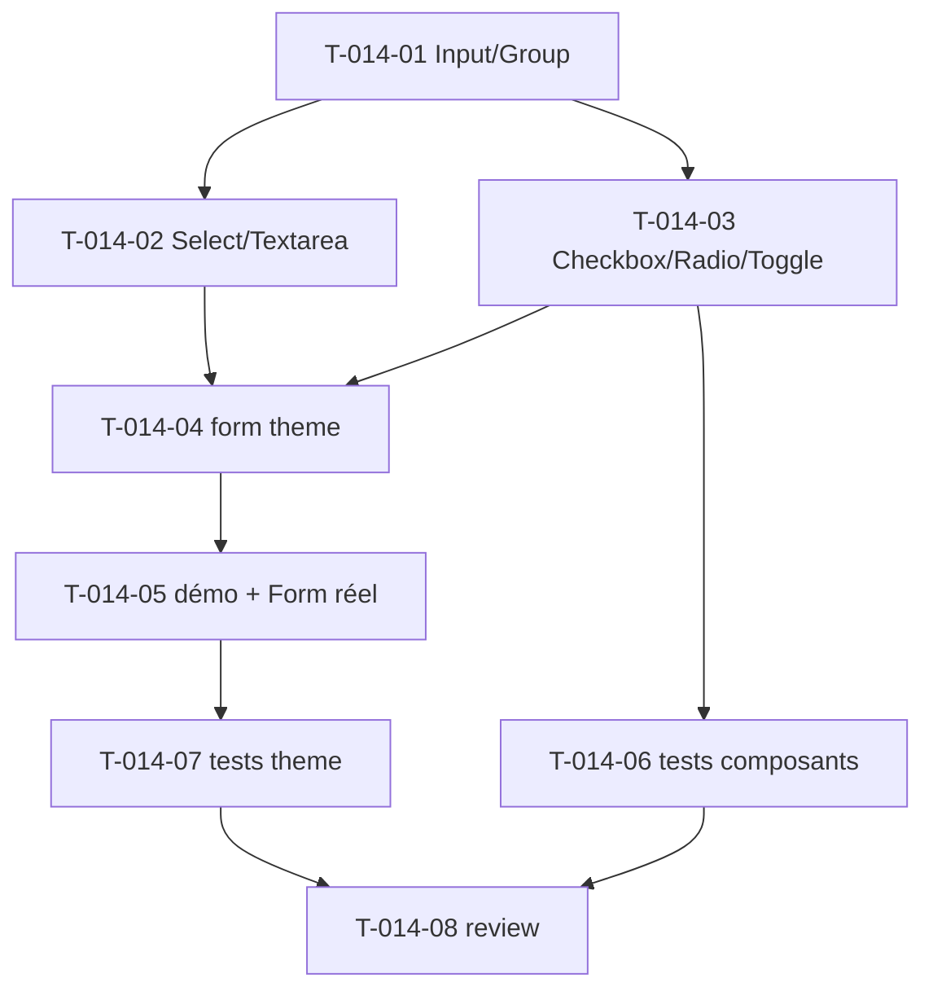

# Tâches — US-014 : Composants de formulaire (autonomes + form theme)

## Informations US
- **Epic** : EPIC-004-formulaires-tables · **Persona** : P-001, P-004 · **Points** : 8 · **Sprint** : sprint-004

## Résumé
**En tant que** développeur / utilisateur **je veux** des composants de formulaire fidèles TailAdmin **afin de** construire des formulaires riches, accessibles, compatibles Symfony Forms.

> **Décision (actée)** : LES DEUX — (1) composants autonomes `tsf:Form:*` pour l'usage direct ; (2) **form theme Symfony** qui les réutilise (`form_row` en style TailAdmin). Priorité aux composants ; theme peut déborder Sprint 5.
> Sources : `src/form-elements.html`, Laravel `components/form/form-elements/*` (11 composants), `components/form/select/multiple-select`.

## Vue d'ensemble des tâches

| ID | Type | Tâche | Est. | Dépend de | Statut |
|----|------|-------|------|-----------|--------|
| T-014-01 | [FE-WEB] | `tsf:Form:Input` + `InputGroup` (types text/email/password…, préfixe/suffixe, états default/success/error/disabled) | 4h | — | 🔲 |
| T-014-02 | [FE-WEB] | `tsf:Form:Select` (+ multiple), `Textarea` | 3h | T-014-01 | 🔲 |
| T-014-03 | [FE-WEB] | `tsf:Form:Checkbox`, `Radio`, `Toggle` | 3h | T-014-01 | 🔲 |
| T-014-04 | [BE] | Form theme Symfony `@Tailsfadmin/form/theme.html.twig` (block_prefixes → style TailAdmin) | 4h | T-014-01,02,03 | 🔲 |
| T-014-05 | [FE-WEB] | Page démo : galerie de champs + un vrai Symfony Form rendu via le theme | 2h | T-014-04 | 🔲 |
| T-014-06 | [TEST] | Tests composants (rendu, états, a11y label/for) | 2h | T-014-03 | 🔲 |
| T-014-07 | [TEST] | Tests form theme (un Form réel rendu applique les classes TailAdmin) | 1.5h | T-014-05 | 🔲 |
| T-014-08 | [REV] | Code review | 0.5h | T-014-06, T-014-07 | 🔲 |

**Total : 20h**

---

## Détail

### T-014-01 · [FE-WEB] Input & InputGroup — 4h
**Fichiers** : `src/Twig/Components/Form/Input.php`, `InputGroup.php` + templates
**Critères** :
- [ ] Types text/email/password/number ; label associé (`for`/`id`), `required`, `placeholder`.
- [ ] États : default, success (bordure verte), error (message + bordure rouge), disabled.
- [ ] `InputGroup` : préfixe/suffixe (icône ou texte). Dark mode, focus visible.

### T-014-02 · [FE-WEB] Select & Textarea — 3h
**Critères** : `Select` (options, `multiple`), `Textarea` (rows) ; états ; `@tailwindcss/forms` cohérent.

### T-014-03 · [FE-WEB] Checkbox, Radio, Toggle — 3h
**Critères** : `.form-check-input` fidèle ; `Toggle` (switch) accessible (`role="switch"`/aria-checked) ; groupes radio.

### T-014-04 · [BE] Form theme Symfony — 4h
**Fichiers** : `templates/form/theme.html.twig` (bundle), doc d'activation (`twig.form_themes`)
**Critères** :
- [ ] Surcharge des blocks (`form_row`, `form_label`, `form_widget`, `form_errors`, `choice_widget_*`, `checkbox_widget`…) → mêmes classes que les composants.
- [ ] `{{ form_row(form.email) }}` rend un champ stylé TailAdmin (label, widget, erreurs).
- [ ] Activable via config ; documenté.

### T-014-05 · [FE-WEB] Démo — 2h
**Critères** : galerie de tous les champs (états) + **un vrai Symfony Form** (démo) rendu via le theme.

### T-014-06 · [TEST] Tests composants — 2h
**Fichiers** : `demo/tests/Functional/FormComponentsTest.php`
**Critères** : rendu des champs, états (error/success/disabled), label `for`=input `id`.

### T-014-07 · [TEST] Tests form theme — 1.5h
**Fichiers** : `demo/tests/Functional/FormThemeTest.php`
**Critères** : un `FormType` réel rendu via le theme applique les classes TailAdmin attendues.

### T-014-08 · [REV] Review — 0.5h

## Graphe

