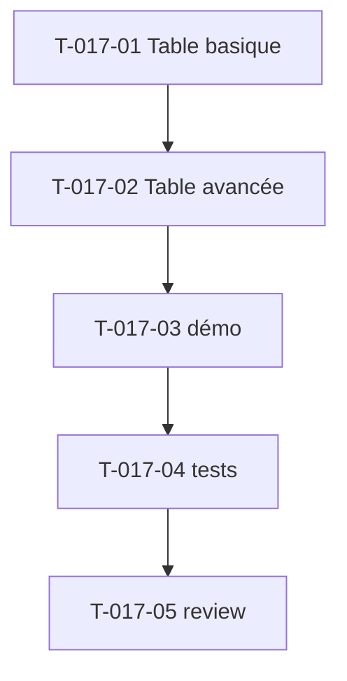

# Tâches — US-017 : Tables (basiques + avancées)

## Informations US
- **Epic** : EPIC-004-formulaires-tables · **Persona** : P-004 · **Points** : 5 · **Sprint** : sprint-004

## Résumé
**En tant que** utilisateur admin **je veux** des tables de données (basiques + avancées) **afin de** consulter et gérer des listes de façon lisible et responsive.

> Sources : `src/partials/table/table-01.html`, `table-06.html`, `src/basic-tables.html`, Laravel `components/tables/basic-tables/one..five`. Composant `tsf:Ui:Table`. Actions par ligne réutilisent le contrôleur `dropdown` (US-012), cellules peuvent utiliser `tsf:Ui:Badge`/`Avatar`.

## Vue d'ensemble des tâches

| ID | Type | Tâche | Est. | Dépend de | Statut |
|----|------|-------|------|-----------|--------|
| T-017-01 | [FE-WEB] | `tsf:Ui:Table` basique (header, rows, cellules, responsive overflow-x) | 3h | — | 🔲 |
| T-017-02 | [FE-WEB] | Table avancée : sélection (checkbox), tri visuel, dropdown d'actions par ligne | 3h | T-017-01 | 🔲 |
| T-017-03 | [FE-WEB] | Démo galerie tables (basique + avancée, avec badges/avatars en cellule) | 1.5h | T-017-02 | 🔲 |
| T-017-04 | [TEST] | Tests (structure thead/tbody, dropdown actions câblé, responsive wrapper) | 2h | T-017-03 | 🔲 |
| T-017-05 | [REV] | Code review | 0.5h | T-017-04 | 🔲 |

**Total : 10h**

---

## Détail

### T-017-01 · [FE-WEB] Table basique — 3h
**Fichiers** : `src/Twig/Components/Ui/Table.php` + template (ou sous-composants Row/Cell)
**Critères** :
- [ ] Structure `thead`/`tbody`, en-têtes, cellules ; slots ou données passées.
- [ ] Responsive : wrapper `overflow-x-auto` (pas de débordement horizontal de la page).
- [ ] Dark mode, zébrures/hover fidèles source.

### T-017-02 · [FE-WEB] Table avancée — 3h
**Critères** :
- [ ] Colonne de sélection (checkbox `.tableCheckbox`) ; en-tête « tout sélectionner ».
- [ ] Indicateurs de tri (icônes) ; **dropdown d'actions** par ligne (réutilise `tailsfadmin--dropdown`).
- [ ] Cellules riches (badge de statut, avatar).

### T-017-03 · [FE-WEB] Démo — 1.5h
**Critères** : une table basique + une avancée dans la galerie.

### T-017-04 · [TEST] Tests — 2h
**Fichiers** : `demo/tests/Functional/TableTest.php`
**Critères** : `thead`/`tbody` présents ; wrapper `overflow-x-auto` ; `data-controller="tailsfadmin--dropdown"` sur les actions.

### T-017-05 · [REV] Review — 0.5h

## Graphe

