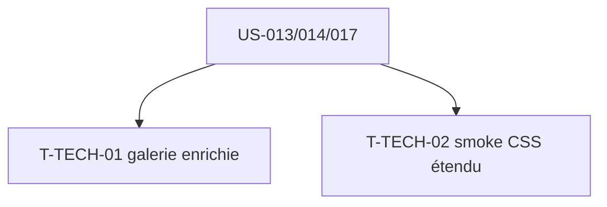

# Tâches techniques transverses — Sprint 004

| ID | Type | Tâche | Est. | Dépend de | Statut |
|----|------|-------|------|-----------|--------|
| T-TECH-01 | [FE-WEB] | Enrichir la galerie `/ui-kit` (sections cards, formulaires, tables) + navigation par ancres | 2h | US-013,014,017 | 🔲 |
| T-TECH-02 | [TEST] | Étendre le smoke-test CSS aux classes de formulaire/table (`.form-check-input`, `.tableCheckbox`) | 1h | US-014,017 | 🔲 |

**Total : 3h**

---

## Détail

### T-TECH-01 · [FE-WEB] Galerie enrichie — 2h
**Fichiers** : `demo/templates/ui-kit/*`, `demo/src/Controller/UiKitController.php`
**Critères** :
- [ ] Sections dédiées cards, formulaires (états + Form réel), tables.
- [ ] Sommaire / ancres pour naviguer ; clair + dark.

### T-TECH-02 · [TEST] Smoke CSS étendu — 1h
**Fichiers** : `demo/tests/Functional/CssBuildTest.php`
**Critères** :
- [ ] Le smoke-test asserte aussi la présence de classes de formulaire (`.form-check-input`) et de table (`.tableCheckbox`) dans le CSS compilé.
- [ ] Attrape une régression de port CSS sur les nouveaux composants.

## Graphe

