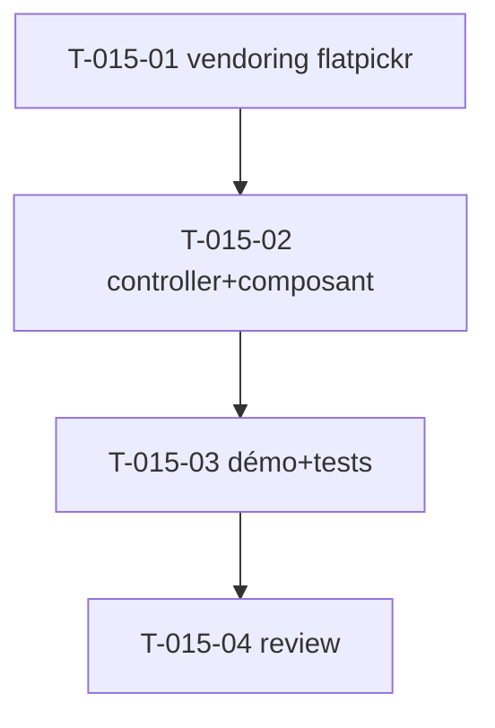

# Tâches — US-015 : Datepicker (flatpickr) en Stimulus

## Informations US
- **Epic** : EPIC-004-formulaires-tables · **Persona** : P-001, P-004 · **Points** : 3 · **Sprint** : sprint-005

## Résumé
**En tant que** développeur / utilisateur **je veux** un datepicker (flatpickr) encapsulé en Stimulus **afin de** choisir des dates dans un formulaire, sans écrire de JS.

> Première lib du sprint → **valide le pattern wrapper + vendoring du CSS d'une lib**. Sources : `src/partials/datepicker.html`, init dans `src/js/index.js` (`flatpickr(".datepicker", { mode:"range" })`).

## Vue d'ensemble des tâches

| ID | Type | Tâche | Est. | Dépend de | Statut |
|----|------|-------|------|-----------|--------|
| T-015-01 | [OPS] | `importmap:require flatpickr` + intégrer son CSS (AssetMapper/@import) | 1.5h | — | 🔲 |
| T-015-02 | [FE-WEB] | Contrôleur `datepicker` (connect/disconnect, values: mode/format, dark-mode aware) + composant `tsf:Form:Datepicker` | 3h | T-015-01 | 🔲 |
| T-015-03 | [TEST] | Démo galerie + tests (input câblé `data-controller`, options via data-values) | 1.5h | T-015-02 | 🔲 |
| T-015-04 | [REV] | Code review | 0.5h | T-015-03 | 🔲 |

**Total : 6.5h**

---

## Détail

### T-015-01 · [OPS] Vendoring flatpickr — 1.5h
**Critères** :
- [ ] `importmap:require flatpickr` (vendoré dans `assets/vendor/`).
- [ ] CSS flatpickr chargé sans CDN (via AssetMapper ou `@import` dans le CSS du bundle), thème compatible.
- [ ] Aucune erreur console au chargement.

### T-015-02 · [FE-WEB] Contrôleur + composant — 3h
**Fichiers** : `assets/controllers/datepicker_controller.js` (+ `package.json`, `demo/assets/controllers.json`), `src/Twig/Components/Form/Datepicker.php` + template
**Critères** :
- [ ] `connect()` : `flatpickr(this.element, options)` ; `disconnect()` : `this._fp.destroy()`.
- [ ] `values` : `mode` (single/range), `dateFormat`, `enableTime`.
- [ ] **Dark-mode aware** (classe sur le calendrier selon `.dark`).
- [ ] Composant `tsf:Form:Datepicker` (input stylé US-014 + `data-controller="tailsfadmin--datepicker"`).

### T-015-03 · [TEST] Démo + tests — 1.5h
**Fichiers** : section galerie + `demo/tests/Functional/DatepickerTest.php`
**Critères** : input rendu avec `data-controller` + data-values ; (comportement d'ouverture réel → Panther T-TECH-01).

### T-015-04 · [REV] Review — 0.5h

## Graphe

