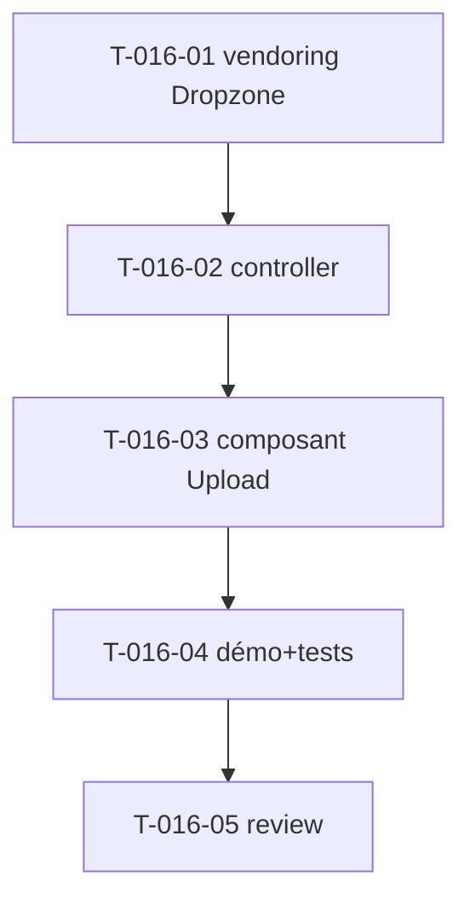

# Tâches — US-016 : Upload de fichiers (Dropzone) en Stimulus

## Informations US
- **Epic** : EPIC-004-formulaires-tables · **Persona** : P-001, P-004 · **Points** : 5 · **Sprint** : sprint-005

## Résumé
**En tant que** développeur / utilisateur **je veux** une zone d'upload (Dropzone) encapsulée en Stimulus **afin de** téléverser des fichiers avec prévisualisation, sans écrire de JS.

> Source : init dans `src/js/index.js` (`new Dropzone("#demo-upload", { url:"/file/post" })`). Endpoint **paramétrable** via values.

## Vue d'ensemble des tâches

| ID | Type | Tâche | Est. | Dépend de | Statut |
|----|------|-------|------|-----------|--------|
| T-016-01 | [OPS] | `importmap:require dropzone` + CSS Dropzone (AssetMapper/@import) | 1.5h | — | 🔲 |
| T-016-02 | [FE-WEB] | Contrôleur `dropzone` (connect/disconnect, values: url/maxFiles/acceptedFiles, dark-mode aware) | 3.5h | T-016-01 | 🔲 |
| T-016-03 | [FE-WEB] | Composant `tsf:Form:Upload` (zone stylée TailAdmin, prévisualisation) | 2h | T-016-02 | 🔲 |
| T-016-04 | [TEST] | Démo + tests (zone câblée, url paramétrable, endpoint démo stub) | 1.5h | T-016-03 | 🔲 |
| T-016-05 | [REV] | Code review | 0.5h | T-016-04 | 🔲 |

**Total : 9h**

---

## Détail

### T-016-01 · [OPS] Vendoring Dropzone — 1.5h
**Critères** : `importmap:require dropzone` ; CSS sans CDN ; pas d'erreur console.

### T-016-02 · [FE-WEB] Contrôleur `dropzone` — 3.5h
**Fichiers** : `assets/controllers/dropzone_controller.js` (+ déclarations)
**Critères** :
- [ ] `connect()` : `new Dropzone(this.element, options)` (autoDiscover=false) ; `disconnect()` : `this._dz.destroy()`.
- [ ] `values` : `url` (endpoint **paramétrable**), `maxFiles`, `maxFilesize`, `acceptedFiles`.
- [ ] Prévisualisation des fichiers ; messages d'erreur (taille/type) ; dark-mode aware.

### T-016-03 · [FE-WEB] Composant Upload — 2h
**Fichiers** : `src/Twig/Components/Form/Upload.php` + template
**Critères** : zone drag&drop stylée TailAdmin (icône, texte), `data-controller="tailsfadmin--dropzone"`, values transmises.

### T-016-04 · [TEST] Démo + tests — 1.5h
**Fichiers** : section galerie + `demo/tests/Functional/UploadTest.php` (+ endpoint stub `POST /demo/upload` renvoyant 200 JSON, côté démo)
**Critères** : zone rendue avec `data-controller` + url ; endpoint stub répond.

### T-016-05 · [REV] Review — 0.5h

## Graphe

