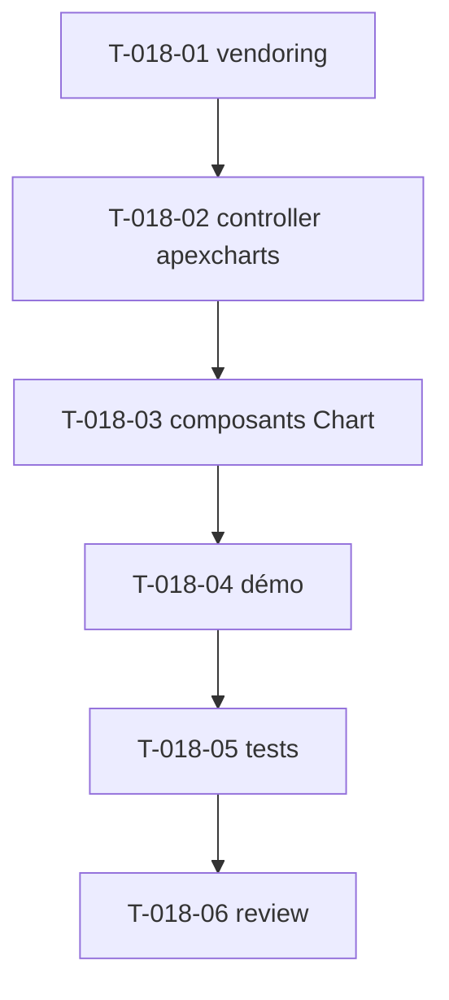

# Tâches — US-018 : Graphiques ApexCharts en Stimulus

## Informations US
- **Epic** : EPIC-005-dataviz-calendrier · **Persona** : P-004 · **Points** : 8 · **Sprint** : sprint-005

## Résumé
**En tant que** utilisateur admin **je veux** des graphiques (courbes, barres, dashboard) fidèles TailAdmin **afin de** visualiser des données, avec un thème cohérent clair/sombre.

> Sources : `src/js/components/charts/chart-01..03.js`, `src/line-chart.html`, `src/bar-chart.html`. Wrapper maison (pas de package UX officiel ApexCharts). Données passées via `values`/`targets` ; dark-mode aware.

## Vue d'ensemble des tâches

| ID | Type | Tâche | Est. | Dépend de | Statut |
|----|------|-------|------|-----------|--------|
| T-018-01 | [OPS] | `importmap:require apexcharts` | 1h | — | 🔲 |
| T-018-02 | [FE-WEB] | Contrôleur `apexcharts` (connect/disconnect, values: type/series/options, dark-mode aware via MutationObserver) | 5h | T-018-01 | 🔲 |
| T-018-03 | [FE-WEB] | Composant `tsf:Chart:Line` + `tsf:Chart:Bar` (données via props → JSON) | 3h | T-018-02 | 🔲 |
| T-018-04 | [FE-WEB] | Pages démo line-chart + bar-chart + un graphique de dashboard | 2h | T-018-03 | 🔲 |
| T-018-05 | [TEST] | Tests (élément câblé `data-controller`, values sérialisées, présence conteneur) | 2h | T-018-04 | 🔲 |
| T-018-06 | [REV] | Code review | 2h | T-018-05 | 🔲 |

**Total : 15h**

---

## Détail

### T-018-01 · [OPS] Vendoring ApexCharts — 1h
**Critères** : `importmap:require apexcharts` (vendoré) ; pas de CDN.

### T-018-02 · [FE-WEB] Contrôleur `apexcharts` — 5h
**Fichiers** : `assets/controllers/apexcharts_controller.js` (+ déclarations)
**Critères** :
- [ ] `connect()` : `new ApexCharts(this.element, options).render()` ; `disconnect()` : `this._chart.destroy()`.
- [ ] `values` : `type` (line/bar/area), `series`, `options` (JSON) ; `targets` si besoin.
- [ ] **Dark-mode aware** : MutationObserver sur `.dark` → `updateOptions({ theme })` sans re-render complet.
- [ ] Couleurs alignées sur les tokens brand.

### T-018-03 · [FE-WEB] Composants Chart — 3h
**Fichiers** : `src/Twig/Components/Chart/Line.php`, `Bar.php` + templates
**Critères** : props `series`/`categories`/`height` → JSON dans `data-*-values` ; conteneur + `data-controller`.

### T-018-04 · [FE-WEB] Démo — 2h
**Critères** : pages/section line-chart, bar-chart, + un graphique type dashboard (`chart-01..03`).

### T-018-05 · [TEST] Tests — 2h
**Fichiers** : `demo/tests/Functional/ChartTest.php`
**Critères** : conteneur avec `data-controller="tailsfadmin--apexcharts"` + values JSON valides. (Rendu réel → Panther T-TECH-01.)

### T-018-06 · [REV] Review — 2h

## Graphe

