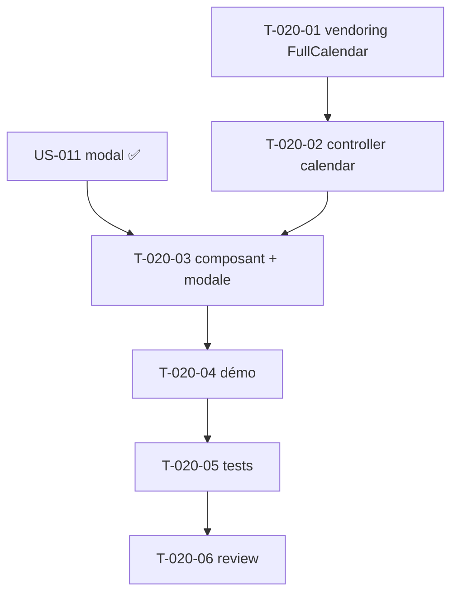

# Tâches — US-020 : Calendrier FullCalendar + modal d'événement

## Informations US
- **Epic** : EPIC-005-dataviz-calendrier · **Persona** : P-004 · **Points** : 8 · **Sprint** : sprint-005

## Résumé
**En tant que** utilisateur admin **je veux** un calendrier (FullCalendar) avec création/édition d'événement via modale **afin de** gérer un planning visuellement.

> Sources : `src/js/components/calendar-init.js` (daygrid/timegrid/list/interaction), `src/partials/calendar-event-modal.html`, `src/calendar.html`. **Réutilise le contrôleur `modal` (US-011)** pour la modale d'événement.

## Vue d'ensemble des tâches

| ID | Type | Tâche | Est. | Dépend de | Statut |
|----|------|-------|------|-----------|--------|
| T-020-01 | [OPS] | `importmap:require @fullcalendar/*` (core + daygrid/timegrid/list/interaction) + CSS | 2h | — | 🔲 |
| T-020-02 | [FE-WEB] | Contrôleur `calendar` (connect/disconnect, values: events/initialView, dateClick/eventClick → ouvre modal, dark-mode aware) | 5h | T-020-01 | 🔲 |
| T-020-03 | [FE-WEB] | Composant `tsf:Calendar` + modale d'événement (réutilise `tsf:Ui:Modal`) | 3h | T-020-02 | 🔲 |
| T-020-04 | [FE-WEB] | Page démo calendrier (events de démo, création via clic) | 1.5h | T-020-03 | 🔲 |
| T-020-05 | [TEST] | Tests (conteneur câblé, modal présente, events sérialisés) | 2h | T-020-04 | 🔲 |
| T-020-06 | [REV] | Code review | 0.5h | T-020-05 | 🔲 |

**Total : 14h**

---

## Détail

### T-020-01 · [OPS] Vendoring FullCalendar — 2h
**Critères** :
- [ ] `importmap:require` des paquets FullCalendar (`@fullcalendar/core`, `daygrid`, `timegrid`, `list`, `interaction`) ; pas de CDN.
- [ ] CSS FullCalendar chargé sans CDN ; pas d'erreur console.

### T-020-02 · [FE-WEB] Contrôleur `calendar` — 5h
**Fichiers** : `assets/controllers/calendar_controller.js` (+ déclarations)
**Critères** :
- [ ] `connect()` : `new Calendar(this.element, { plugins, initialView, events })` + `render()` ; `disconnect()` : `destroy()`.
- [ ] `values` : `events` (JSON), `initialView` (dayGridMonth/timeGridWeek/listWeek).
- [ ] `dateClick`/`eventClick` → **ouvre la modale d'événement** (dispatch vers le contrôleur `modal`).
- [ ] Dark-mode aware.

### T-020-03 · [FE-WEB] Composant + modale — 3h
**Fichiers** : `src/Twig/Components/Calendar.php` + template ; modale via `tsf:Ui:Modal`
**Critères** : conteneur `data-controller="tailsfadmin--calendar"` ; modale (titre, dates, description) réutilisant `tsf:Ui:Modal` (US-011).

### T-020-04 · [FE-WEB] Démo — 1.5h
**Critères** : page/section calendrier avec events de démo ; clic sur une date ouvre la modale.

### T-020-05 · [TEST] Tests — 2h
**Fichiers** : `demo/tests/Functional/CalendarTest.php`
**Critères** : conteneur `data-controller` + events JSON ; modale d'événement présente (`role="dialog"`). (Interaction réelle → Panther T-TECH-01.)

### T-020-06 · [REV] Review — 0.5h

## Graphe

