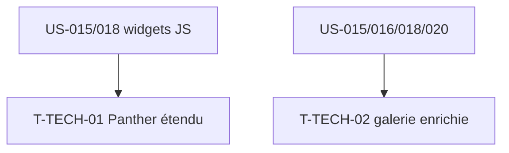

# Tâches techniques transverses — Sprint 005

> Ce sprint introduit du **comportement JS runtime** (montage de libs) que les tests fonctionnels ne voient pas → on étend le garde-fou Panther. Plus une consolidation galerie.

| ID | Type | Tâche | Est. | Dépend de | Statut |
|----|------|-------|------|-----------|--------|
| T-TECH-01 | [TEST] | Étendre Panther : 1-2 tests navigateur sur le montage réel d'une lib (ex. chart rendu, datepicker ouvert au focus) | 2.5h | US-018 ou US-015 | 🔲 |
| T-TECH-02 | [FE-WEB] | Galerie `/ui-kit` : sections charts, datepicker, upload, calendrier (+ ancres) | 1.5h | US-015,016,018,020 | 🔲 |

**Total : 4h**

---

## Détail

### T-TECH-01 · [TEST] Panther étendu — 2.5h (garde-fou comportement JS)
**Contexte** : les libs (ApexCharts, flatpickr…) se montent en JS ; un test fonctionnel ne vérifie que le câblage DOM. On prouve le **montage réel** au navigateur.
**Fichiers** : `demo/tests/E2E/WidgetsE2ETest.php`
**Critères** :
- [ ] Au moins 1 test : charger la page, attendre qu'ApexCharts ait injecté son SVG (`.apexcharts-canvas` présent), ou que flatpickr ouvre le calendrier au focus.
- [ ] Isolé dans la suite `e2e` (`composer test:e2e`), hors de `composer test`.

### T-TECH-02 · [FE-WEB] Galerie enrichie — 1.5h
**Fichiers** : `demo/templates/ui-kit/*`, `demo/src/Controller/UiKitController.php`
**Critères** :
- [ ] Sections charts (line/bar), datepicker, upload, calendrier ajoutées au sommaire/ancres.
- [ ] Clair + dark.

## Graphe

