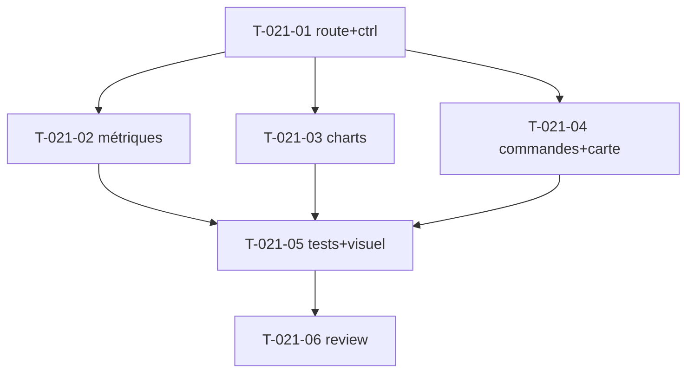

# Tâches — US-021 : Dashboard e-commerce

## Informations US
- **Epic** : EPIC-006-pages-i18n · **Persona** : P-004 · **Points** : 5 · **Sprint** : sprint-006

## Résumé
**En tant que** utilisateur admin **je veux** un tableau de bord e-commerce complet **afin d'**avoir une vue synthétique de l'activité (métriques, ventes, cibles, commandes, démographie).

> **Assemblage pur** des composants existants. Sources : `src/index.html`, Laravel `components/ecommerce/*` (ecommerce-metrics, monthly-target, monthly-sale, statistics-chart, customer-demographic, recent-orders).

## Vue d'ensemble des tâches

| ID | Type | Tâche | Est. | Dépend de | Statut |
|----|------|-------|------|-----------|--------|
| T-021-01 | [FE-WEB] | Route `/dashboard` (ou `/`) + contrôleur + données de démo | 2h | — | 🔲 |
| T-021-02 | [FE-WEB] | Rangée de métriques (cards + badges variation) + cible mensuelle | 3h | T-021-01 | 🔲 |
| T-021-03 | [FE-WEB] | Graphiques ventes mensuelles + statistiques (tsf:Chart) | 2h | T-021-01 | 🔲 |
| T-021-04 | [FE-WEB] | Commandes récentes (tsf:Ui:Table + Badge statut + Avatar) + démographie (carte US-019 ou placeholder) | 3h | T-021-01 | 🔲 |
| T-021-05 | [TEST] | Tests page (présence sections, composants câblés) + **revue visuelle** | 1.5h | T-021-02,03,04 | 🔲 |
| T-021-06 | [REV] | Code review | 0.5h | T-021-05 | 🔲 |

**Total : 12h**

---

## Détail

### T-021-01 · [FE-WEB] Route + contrôleur — 2h
**Fichiers** : `demo/src/Controller/DashboardController.php`, `demo/templates/dashboard/index.html.twig`
**Critères** : route dédiée, données de démo (métriques, séries, commandes), hérite du layout admin.

### T-021-02 · [FE-WEB] Métriques + cible — 3h
**Critères** : cards KPI (clients, commandes, revenus) avec badge de variation (↑/↓) ; jauge/cible mensuelle. Réutilise `tsf:Ui:Card`, `tsf:Ui:Badge`.

### T-021-03 · [FE-WEB] Graphiques — 2h
**Critères** : ventes mensuelles (bar) + graphique statistiques (line/area) via `tsf:Chart:Bar`/`Line` (données de démo).

### T-021-04 · [FE-WEB] Commandes + démographie — 3h
**Critères** :
- Table des commandes récentes (`tsf:Ui:Table`), statut en `tsf:Ui:Badge`, client en `tsf:Ui:Avatar`.
- Démographie client : **carte** via US-019 (jsvectormap) si intégration rapide, **sinon placeholder** stylé.

### T-021-05 · [TEST] Tests + revue visuelle — 1.5h
**Fichiers** : `demo/tests/Functional/DashboardTest.php`
**Critères** : sections présentes, `data-controller` charts, table rendue. **Screenshot** clair + dark validé.

### T-021-06 · [REV] Review — 0.5h

## Graphe

