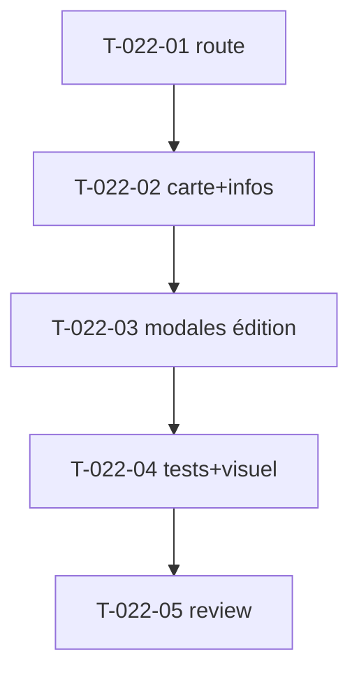

# Tâches — US-022 : Page profil + modals d'édition

## Informations US
- **Epic** : EPIC-006-pages-i18n · **Persona** : P-004 · **Points** : 5 · **Sprint** : sprint-006

## Résumé
**En tant que** utilisateur admin **je veux** une page profil avec édition (infos personnelles, adresse) **afin de** consulter et modifier mes informations.

> Sources : `src/profile.html`, `src/partials/profile/profile-info-modal.html`, `profile-address-modal.html`, Laravel `components/profile/*`. Réutilise `tsf:Ui:Modal` (US-011), `tsf:Ui:Avatar`, composants form (US-014).

## Vue d'ensemble des tâches

| ID | Type | Tâche | Est. | Dépend de | Statut |
|----|------|-------|------|-----------|--------|
| T-022-01 | [FE-WEB] | Route `/profile` + contrôleur + données de démo | 1.5h | — | 🔲 |
| T-022-02 | [FE-WEB] | Carte profil (avatar, nom, rôle, social) + infos personnelles | 3h | T-022-01 | 🔲 |
| T-022-03 | [FE-WEB] | Modale édition infos + modale édition adresse (tsf:Ui:Modal + form) | 3h | T-022-02 | 🔲 |
| T-022-04 | [TEST] | Tests (sections, modales role=dialog, form) + **revue visuelle** | 2h | T-022-03 | 🔲 |
| T-022-05 | [REV] | Code review | 0.5h | T-022-04 | 🔲 |

**Total : 10h**

---

## Détail

### T-022-01 · [FE-WEB] Route + contrôleur — 1.5h
**Fichiers** : `demo/src/Controller/ProfileController.php`, `demo/templates/profile/index.html.twig`
**Critères** : route `/profile`, données de démo (utilisateur), hérite du layout.

### T-022-02 · [FE-WEB] Carte profil + infos — 3h
**Critères** : carte profil (`tsf:Ui:Avatar` grand, nom, rôle, liens sociaux), bloc infos personnelles (champs en lecture), responsive/dark.

### T-022-03 · [FE-WEB] Modales d'édition — 3h
**Critères** :
- Modale « infos personnelles » et modale « adresse », chacune réutilisant `tsf:Ui:Modal` (US-011) + composants form (US-014).
- Boutons « Éditer » ouvrent la bonne modale ; formulaires stylés TailAdmin.

### T-022-04 · [TEST] Tests + revue — 2h
**Fichiers** : `demo/tests/Functional/ProfileTest.php`
**Critères** : carte profil présente, 2 modales `role="dialog"` + `data-controller` modal, form dans les modales. **Screenshot** (dont une modale ouverte).

### T-022-05 · [REV] Review — 0.5h

## Graphe

