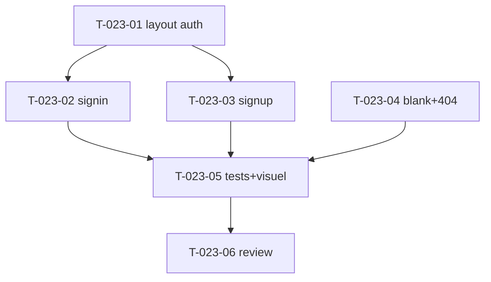

# Tâches — US-023 : Pages d'authentification + utilitaires

## Informations US
- **Epic** : EPIC-006-pages-i18n · **Persona** : P-004, P-001 · **Points** : 5 · **Sprint** : sprint-006

## Résumé
**En tant que** utilisateur / développeur **je veux** des pages signin, signup, blank et 404 **afin de** disposer des écrans d'entrée et de gabarits (UI de démo, pas d'auth production).

> Sources : `src/signin.html`, `src/signup.html`, `src/blank.html`, `src/404.html`. Réutilise layout (US-004), form + form theme (US-014), buttons (US-010). Auth = **UI de démo** (pas de logique de sécurité réelle).

## Vue d'ensemble des tâches

| ID | Type | Tâche | Est. | Dépend de | Statut |
|----|------|-------|------|-----------|--------|
| T-023-01 | [FE-WEB] | Layout auth (centré, sans sidebar) + route/contrôleur auth | 2h | — | 🔲 |
| T-023-02 | [FE-WEB] | Page signin (form email/password, remember, liens) | 2h | T-023-01 | 🔲 |
| T-023-03 | [FE-WEB] | Page signup (form inscription) | 2h | T-023-01 | 🔲 |
| T-023-04 | [FE-WEB] | Page blank (gabarit) + page 404 (branchée error Symfony, pas de stack en prod) | 2.5h | — | 🔲 |
| T-023-05 | [TEST] | Tests (signin/signup 200 + form, 404 en prod sans stack) + **revue visuelle** | 2h | T-023-02,03,04 | 🔲 |
| T-023-06 | [REV] | Code review | 0.5h | T-023-05 | 🔲 |

**Total : 11h**

---

## Détail

### T-023-01 · [FE-WEB] Layout auth + route — 2h
**Fichiers** : `templates/layout/auth.html.twig` (bundle, centré sans sidebar), `demo/src/Controller/AuthController.php`
**Critères** : layout auth minimal (logo, carte centrée), dark mode. Routes `/signin`, `/signup`.

### T-023-02 · [FE-WEB] Signin — 2h
**Source** : `src/signin.html`
**Critères** : form email/password (composants US-014), case « remember », liens (mot de passe oublié, signup). UI de démo (pas de POST d'auth réel).

### T-023-03 · [FE-WEB] Signup — 2h
**Source** : `src/signup.html`
**Critères** : form d'inscription (nom, email, password, CGU). UI de démo.

### T-023-04 · [FE-WEB] Blank + 404 — 2.5h
**Sources** : `src/blank.html`, `src/404.html`
**Critères** :
- Blank : gabarit vide héritant du layout (point de départ).
- 404 : template d'erreur Symfony (`error404.html.twig`), illustration ; **en prod, pas de stack trace** (scénario erreur US-023).

### T-023-05 · [TEST] Tests + revue — 2h
**Fichiers** : `demo/tests/Functional/AuthPagesTest.php`
**Critères** : `/signin` et `/signup` → 200 avec form ; blank 200 ; 404 rendu ; test prod sans stack. **Screenshots**.

### T-023-06 · [REV] Review — 0.5h

## Graphe

