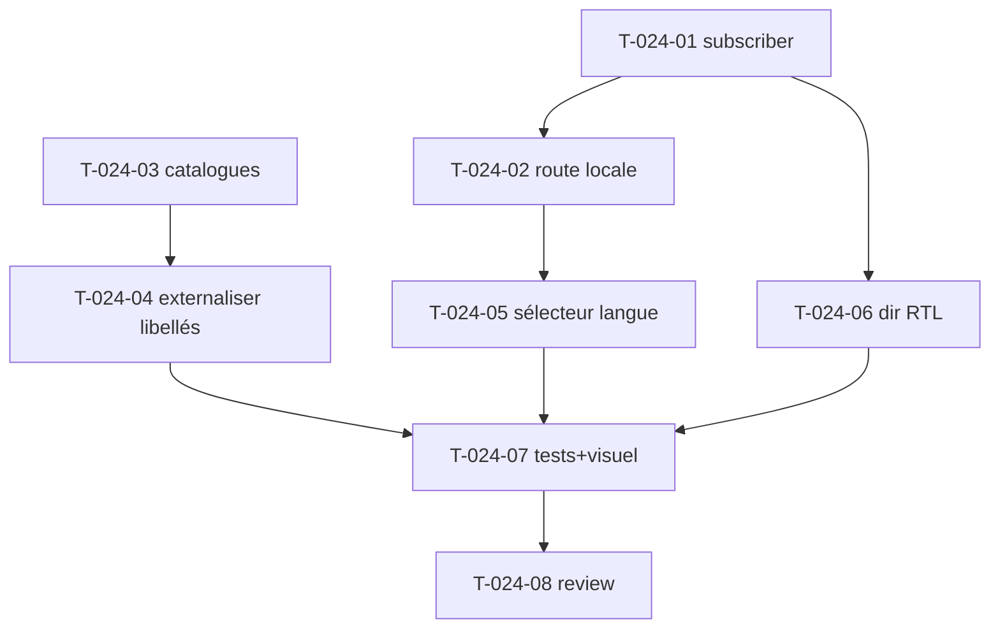

# Tâches — US-024 : i18n FR/EN + RTL + sélecteur de langue

## Informations US
- **Epic** : EPIC-006-pages-i18n · **Persona** : P-004 · **Points** : 8 · **Sprint** : sprint-006

## Résumé
**En tant que** utilisateur admin **je veux** basculer la langue de l'interface (FR/EN, structure RTL) **afin d'**utiliser l'admin dans ma langue.

> **ADR-005.** Sources : Laravel `SetLocale`, `LocaleController` (4 langues dont `ar` RTL). **Catalogues absents des sources → à recréer.** Classes `ltr:`/`rtl:` déjà posées (sidebar S2) ; sélecteur dans le header (S2).

## Vue d'ensemble des tâches

| ID | Type | Tâche | Est. | Dépend de | Statut |
|----|------|-------|------|-----------|--------|
| T-024-01 | [BE] | `LocaleSubscriber` (kernel.request : session→cookie→défaut, whitelist) | 3h | — | 🔲 |
| T-024-02 | [BE] | Route + contrôleur `/locale/{locale}` (persiste locale + dir, redirect back) | 2h | T-024-01 | 🔲 |
| T-024-03 | [BE] | Catalogues `translations/` : en + fr complets ; ar/es/de en structure | 3h | — | 🔲 |
| T-024-04 | [FE-WEB] | Externaliser les libellés du layout/sidebar/header en clés `trans` | 3h | T-024-03 | 🔲 |
| T-024-05 | [FE-WEB] | Composant sélecteur de langue (dropdown : nom natif + drapeau + dir) dans le header | 2.5h | T-024-02 | 🔲 |
| T-024-06 | [FE-WEB] | Attribut `dir` sur `<html>` selon la locale (support RTL) | 1.5h | T-024-01 | 🔲 |
| T-024-07 | [TEST] | Tests (bascule locale, fallback, `dir=rtl` pour ar) + **revue visuelle dark×RTL** | 2h | T-024-05,06 | 🔲 |
| T-024-08 | [REV] | Code review | 1h | T-024-07 | 🔲 |

**Total : 18h**

---

## Détail

### T-024-01 · [BE] LocaleSubscriber — 3h
**Fichiers** : `src/EventSubscriber/LocaleSubscriber.php` (bundle)
**Critères** : résout la locale (session → cookie → `default_locale`), valide contre une **whitelist** (fallback sinon), `Request::setLocale()`. Priorité élevée.

### T-024-02 · [BE] Route locale — 2h
**Fichiers** : `src/Controller/LocaleController.php` (bundle)
**Critères** : `GET /locale/{locale}` (garde whitelist) stocke locale **et `dir`** (ltr/rtl) en session + cookie (1 an), `redirect back`.

### T-024-03 · [BE] Catalogues — 3h
**Fichiers** : `translations/messages.en.yaml`, `messages.fr.yaml` (complets), `messages.ar.yaml`/`es`/`de` (structure/clés)
**Critères** : clés du chrome (menu, header, actions communes) traduites ; `fallback_locale: en`.

### T-024-04 · [FE-WEB] Externaliser les libellés — 3h
**Critères** : remplacer les libellés en dur (sidebar/header/breadcrumb) par `{{ 'key'|trans }}`. Le MenuBuilder expose des clés de traduction.

### T-024-05 · [FE-WEB] Sélecteur de langue — 2.5h
**Source** : Laravel `components/common/dropdown-menu` (sélecteur)
**Critères** : dropdown (réutilise `tsf:Ui:Dropdown`) listant les langues (nom natif + drapeau), lien vers `/locale/{locale}`.

### T-024-06 · [FE-WEB] Direction RTL — 1.5h
**Critères** : `<html dir="{{ ... }}">` selon la locale ; combinable avec dark mode.

### T-024-07 · [TEST] Tests + revue — 2h
**Fichiers** : `demo/tests/Functional/LocaleTest.php`
**Critères** : `/locale/fr` puis page en FR ; locale inconnue → fallback en ; `/locale/ar` → `dir="rtl"`. **Screenshot dark × RTL** (action reportée des rétros précédentes).

### T-024-08 · [REV] Review — 1h

## Graphe

