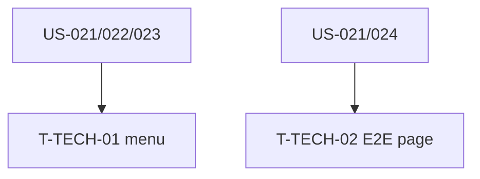

# Tâches techniques transverses — Sprint 006

| ID | Type | Tâche | Est. | Dépend de | Statut |
|----|------|-------|------|-----------|--------|
| T-TECH-01 | [FE-WEB] | Sidebar/nav : lier les nouvelles pages (dashboard, profil, auth) via MenuBuilder | 1h | US-021,022,023 | 🔲 |
| T-TECH-02 | [TEST] | E2E Panther : parcours de page réel (dashboard charts montés / bascule de langue) | 2h | US-021 ou US-024 | 🔲 |

**Total : 3h**

---

## Détail

### T-TECH-01 · [FE-WEB] Câblage navigation — 1h
**Fichiers** : `demo/config/packages/tailsfadmin.yaml` (menu)
**Critères** : les entrées de menu (Dashboard, Profile, Auth) pointent vers les nouvelles routes ; item actif correct (`is_active`).

### T-TECH-02 · [TEST] E2E parcours page — 2h (garde-fou runtime)
**Fichiers** : `demo/tests/E2E/PagesE2ETest.php`
**Critères** :
- Au moins 1 parcours navigateur : charger `/dashboard` et vérifier que les charts sont montés (`.apexcharts-canvas`), OU bascule de langue (`/locale/fr` → libellé traduit visible).
- Isolé dans la suite `e2e` (`composer test:e2e`).

## Graphe

