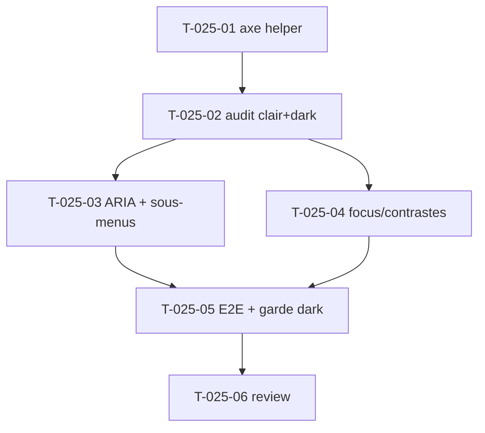

# Tâches — US-025 : Accessibilité WCAG 2.2 AA (transversal)

## Informations US
- **Epic** : EPIC-007-qualite-a11y-doc · **Persona** : P-004 · **Points** : 5 · **Sprint** : sprint-007

## Résumé
**En tant que** utilisateur final **je veux** naviguer dans toutes les pages au clavier et au lecteur d'écran **afin d'**utiliser l'interface sans souris, en conformité WCAG 2.2 AA (clair, dark et RTL).

> Audit transversal des pages assemblées (US-021/022/023) + mode RTL (US-024). Outil : **axe-core** injecté dans les tests Panther (automatisé, bloquant). Corrections dans les templates du bundle.

## Vue d'ensemble des tâches

| ID | Type | Tâche | Est. | Dépend de | Statut |
|----|------|-------|------|-----------|--------|
| T-025-01 | [TEST] | Vendorer axe-core + helper Panther (injection + extraction violations AA) | 2.5h | — | 🔲 |
| T-025-02 | [TEST] | Audit axe-core des pages (dashboard, profil+modales, auth, 404) en clair ET dark | 2h | T-025-01 | 🔲 |
| T-025-03 | [FE-WEB] | Corrections ARIA + sous-menus sidebar repliables (Stimulus + aria-expanded) | 3h | T-025-02 | 🔲 |
| T-025-04 | [FE-WEB] | Focus visible + ordre de tabulation + contrastes (clair/dark/RTL) | 3h | T-025-02 | 🔲 |
| T-025-05 | [TEST] | E2E axe (0 violation) + navigation clavier + garde visuelle dark | 2.5h | T-025-03,04 | 🔲 |
| T-025-06 | [REV] | Code review a11y + revue clavier/lecteur d'écran | 0.5h | T-025-05 | 🔲 |

**Total : 13.5h**

---

## Détail

### T-025-01 · [TEST] Vendorer axe-core + helper d'audit — 2.5h
**Fichiers** : `demo/assets/vendor/axe-core/…` (ou téléchargement dans le job), `demo/tests/E2E/Support/AxeAudit.php` (trait/helper).
**Critères** :
- axe-core disponible hors CDN (vendoré ou fetch en CI).
- Helper Panther : `runAxe($client, $context)` injecte `axe.min.js` via `executeScript`, lance `axe.run` (tags `wcag2a`, `wcag2aa`, `wcag22aa`), retourne les violations (règle, impact, sélecteur, WCAG).
- Assertion réutilisable : `assertNoAxeViolations()` échoue avec un rapport lisible (règle + élément).

### T-025-02 · [TEST] Audit initial (clair + dark) — 2h
**Critères** : lancer l'audit sur `/`, `/profile` (dont une modale ouverte), `/auth/login`, `/auth/register`, page 404, en **clair ET dark**. Recenser les violations dans un tableau (page × thème × règle) pour piloter T-025-03/04. RTL (`/locale/ar`) inclus pour l'ordre de lecture.

### T-025-03 · [FE-WEB] Corrections ARIA + sous-menus repliables — 3h
**Fichiers** : `templates/components/Layout/Sidebar.html.twig`, `assets/controllers/` (nouveau `submenu`/extension sidebar), `templates/components/*` (jauge, barres démographie), `demo/templates/dashboard/index.html.twig`.
**Critères** :
- **Sous-menus sidebar réellement repliables** : remplacer le `x-data` Alpine vestigial par un contrôleur Stimulus ; bouton `aria-expanded` dynamique (`false`↔`true`), items du sous-menu masqué avec `aria-hidden="true"` + non focusables quand replié.
- `role="progressbar"` + `aria-valuenow/min/max` sur la jauge d'objectif et les barres de démographie.
- Libellés de liens descriptifs (pas de « cliquez ici ») ; `alt` sur images non décoratives ; `aria-label` cohérents (déjà via i18n S6).

### T-025-04 · [FE-WEB] Focus, tabulation, contrastes — 3h
**Fichiers** : `assets/styles/app.css` (focus-visible), templates concernés.
**Critères** :
- Indicateur de focus visible sur chaque élément interactif (`:focus-visible` ring, ratio ≥ 3:1) — jamais d'`outline:none` sans remplacement.
- Ordre de tabulation logique = ordre visuel (vérifier header/sidebar/contenu, y compris RTL).
- Contrastes texte ≥ 4,5:1 (large ≥ 3:1) vérifiés en clair ET dark (corriger les gris trop clairs le cas échéant).

### T-025-05 · [TEST] E2E a11y + garde visuelle dark — 2.5h
**Fichiers** : `demo/tests/E2E/AccessibilityE2ETest.php`, `demo/tests/E2E/WidgetsE2ETest.php` (ou dédié).
**Critères** :
- **axe 0 violation AA** sur dashboard + profil, en clair ET dark.
- **Navigation clavier** : Tab parcourt dans l'ordre ; **Échap ferme la modale et rend le focus au déclencheur** ; toggle `aria-expanded` du sous-menu.
- **Garde visuelle dark (action rétro S6)** : vérifie qu'un input / bouton secondary / panel de modale a un fond **sombre** en dark (computed bg foncé) — échoue si l'inversion des gris réapparaît.

### T-025-06 · [REV] Review — 0.5h
Relecture des corrections a11y ; passage clavier manuel ; DoD.

## Graphe

