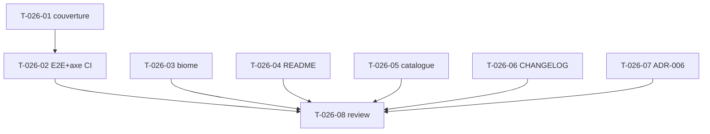

# Tâches — US-026 : CI, documentation & livrabilité du bundle

## Informations US
- **Epic** : EPIC-007-qualite-a11y-doc · **Persona** : P-003 (mainteneur) · **Points** : 8 · **Sprint** : sprint-007

## Résumé
**En tant que** mainteneur du bundle **je veux** une CI complète, une documentation d'installation et d'usage, un CHANGELOG SemVer **afin de** rendre tailsfadmin professionnel et adoptable par la communauté Symfony.

> La CI existe déjà (`.github/workflows/ci.yml` : PHPStan max + cs-fixer + tests bundle/démo) — on l'**étend** (couverture, E2E+axe, lint front). Doc : README (présent, à enrichir), catalogue composants (nouveau), CHANGELOG (nouveau), ADR-006 (nouveau).

## Vue d'ensemble des tâches

| ID | Type | Tâche | Est. | Dépend de | Statut |
|----|------|-------|------|-----------|--------|
| T-026-01 | [OPS] | CI : couverture PCOV ≥ 80 % sur `src/` bundle + artefact, échec sous seuil | 2.5h | — | 🔲 |
| T-026-02 | [OPS] | CI : job E2E Panther (Chrome) incluant l'audit axe-core (US-025) | 2.5h | US-025, T-026-01 | 🔲 |
| T-026-03 | [OPS] | Lint front (biome) des assets du bundle + job CI | 2h | — | 🔲 |
| T-026-04 | [DOC] | README bundle : installation + configuration + quickstart | 2.5h | — | 🔲 |
| T-026-05 | [DOC] | Catalogue composants `docs/components.md` + section « gotchas » | 3.5h | — | 🔲 |
| T-026-06 | [DOC] | CHANGELOG.md (Keep a Changelog) + SemVer 1.0.0 + vérif `composer.json` | 1.5h | — | 🔲 |
| T-026-07 | [DOC] | ADR-006 « intégration d'une lib JS via importmap » | 1.5h | — | 🔲 |
| T-026-08 | [REV] | Code review + validation CI verte (tous jobs) | 1h | T-026-01..07 | 🔲 |

**Total : 17h**

---

## Détail

### T-026-01 · [OPS] Couverture ≥ 80 % en CI — 2.5h
**Fichiers** : `.github/workflows/ci.yml`, `phpunit.dist.xml` (coverage source `src/`).
**Critères** :
- Job bundle : `coverage: pcov` (setup-php), `phpunit --coverage-text --coverage-clover` avec **seuil ≥ 80 %** sur `src/` (échec si inférieur).
- Rapport (clover/HTML) archivé en artefact CI.
- Compléter les tests unitaires du bundle si nécessaire pour atteindre le seuil.

### T-026-02 · [OPS] Job E2E Panther + axe en CI — 2.5h
**Fichiers** : `.github/workflows/ci.yml`.
**Critères** :
- Nouveau job (ou extension du job démo) : installer Chrome + chromedriver, builder les assets, lancer `composer test:e2e` (montage JS réel).
- Inclut l'**audit axe-core** d'US-025 (0 violation AA) — bloque le merge.
- Isolé/parallélisable ; caché pour la vitesse.

### T-026-03 · [OPS] Lint front (biome) — 2h
**Fichiers** : `biome.json` (racine bundle), `.github/workflows/ci.yml`.
**Critères** :
- Configurer **biome** sur `assets/` du bundle (contrôleurs Stimulus).
- Corriger les éventuels warnings.
- Job CI `biome ci` (ou `biome check`) bloquant.

### T-026-04 · [DOC] README bundle — 2.5h
**Fichiers** : `README.md`.
**Critères** :
- Installation : `composer require tailsfadmin/tailsfadmin-bundle`, enregistrement (`config/bundles.php` via Flex), `importmap.php`, build Tailwind (symfonycasts/tailwind-bundle).
- Configuration : `tailsfadmin.yaml` (menu, locales), extension du layout `@Tailsfadmin/layout/admin.html.twig`.
- Quickstart : première page + lien vers le catalogue de composants.

### T-026-05 · [DOC] Catalogue de composants — 3.5h
**Fichiers** : `docs/components.md`.
**Critères** :
- Lister tous les composants `tsf:*` (Ui, Form, Chart, Layout) avec balise Twig, **props/slots** (type + défaut) et **exemple** d'usage.
- Section **« gotchas »** (action rétro S6) : `tsf:Ui:Button` ne propage pas `{{ attributes }}` ; `_self.macro()` ne traverse pas un slot de composant (→ `include`) ; SVG en prop via `:iconStart="var"`.

### T-026-06 · [DOC] CHANGELOG + SemVer — 1.5h
**Fichiers** : `CHANGELOG.md`, `composer.json`.
**Critères** :
- `CHANGELOG.md` format Keep a Changelog, section `## [1.0.0] — 2026-…` récapitulant les Sprints 1-7 (Added/Changed/Fixed/Security).
- Vérifier `composer.json` : `name`, `type: symfony-bundle`, `require`, `autoload`, `extra.symfony.*` complets et cohérents.

### T-026-07 · [DOC] ADR-006 intégration lib JS — 1.5h
**Fichiers** : `docs/adr/0006-integration-lib-js-importmap.md`.
**Critères** : documenter la recette (report rétro S5/S6) : `importmap:require <lib>` (+ `type:css`), wrapper Stimulus (connect/disconnect/destroy, dark), **déclaration dans `assets/package.json` (`symfony.controllers`)**, pièges (stubs de packaging, « controller does not exist in the package »).

### T-026-08 · [REV] Review — 1h
Relecture doc + CI ; vérifier que **tous les jobs CI passent** (PHPStan, cs-fixer, tests+couverture, E2E+axe, biome).

## Graphe

