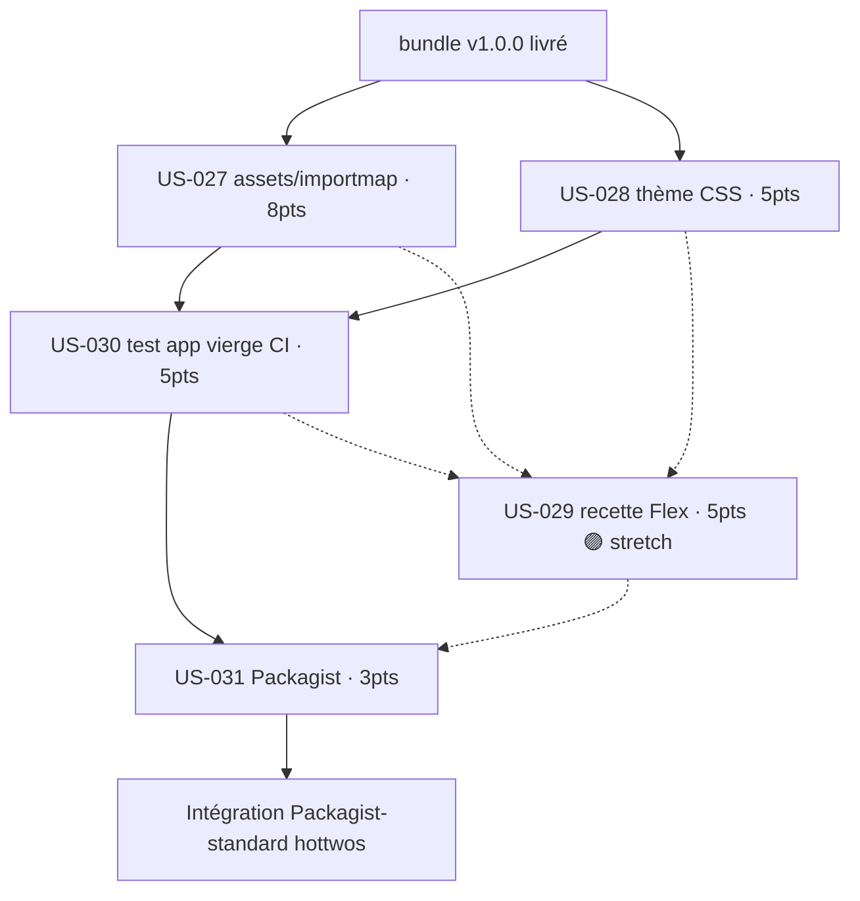

# Dépendances — Sprint 008 (Distribution & consommabilité)

## Graphe inter-US

## Chemin critique

`US-027 + US-028 → US-030 → US-031`

- **US-027** et **US-028** sont parallélisables (assets JS vs CSS, indépendants).
- **US-030** valide 027/028 sur une app réelle → **prérequis à la publication**.
- **US-031** (Packagist) publie **uniquement après US-030 verte** (décision « publier après intégration prouvée »).
- **US-029** (recette) est un stretch greffé sur 027/028, contribuable seulement après US-031.

## Matrice des dépendances

| US | Dépend de | Bloque |
|----|-----------|--------|
| US-027 | bundle v1.0.0 | US-029, US-030, US-031 |
| US-028 | bundle v1.0.0 (`assets/styles/app.css`) | US-029, US-030 |
| US-030 | US-027, US-028 (US-029 si prête) | US-031 |
| US-031 | US-027, US-028, US-030 (US-029 si contrib) | intégration hottwos |
| US-029 🟣 | US-027, US-028 (US-030 vérif, US-031 contrib) | contribution recipes-contrib |

## Dépendances externes / risques

| Élément | Nature | Mitigation |
|---------|--------|------------|
| API AssetMapper (`prepend` importmap survit-il au merge ?) | Incertitude technique | Spike T-027-01 + fallback commande dédiée |
| CSS bundle scanné côté hôte (utilitaires générés) | Risque Tailwind | `@source` portable (US-028) + smoke CSS (US-030) |
| Compte / droits Packagist + webhook GitHub | Externe (ops) | Préparé pendant US-027..030, exécuté en T-031-05 |
| `symfony/recipes-contrib` (revue upstream) | Externe, hors sprint | US-029 stretch, contrib post-publication |

> Détail des enchaînements de tâches **intra-US** : voir les graphes Mermaid dans chaque `tasks/US-XXX-tasks.md`.
